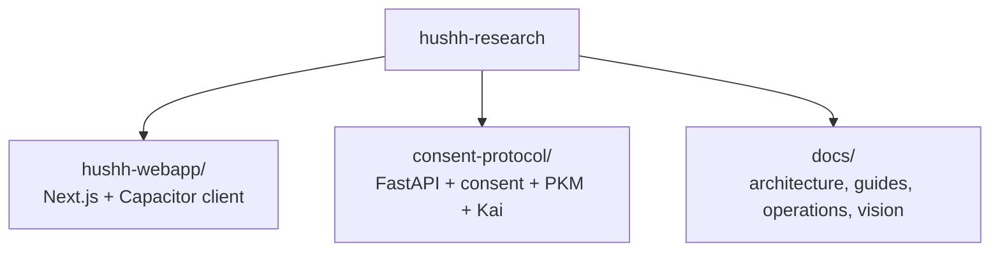

<p align="center">
  
</p>

<h1 align="center">Hushh Research</h1>

<p align="center">
  <strong>Consent-first personal data agents</strong><br/>
  <em>Your data. Your vault. Your agents.</em>
</p>

<p align="center">
  
  
  
  
  <br/>
  
  
  
  <a href="https://discord.gg/fd38enfsH5"></a>
</p>

## What Hushh Is

**Hushh** is a consent-first platform for personal agents and agent-assisted workflows.

The core trust contract is straightforward:

- the user holds the key boundary
- the backend stores ciphertext and metadata, not plaintext
- access is explicitly scoped
- agents act only within granted consent boundaries

Where the shorthand helps, the trust model can be read as:

- **Secure**: user-private data remains encrypted end to end
- **Scoped**: operations are limited to the granted scope
- **Handled by the user**: the person whose data is being touched authorizes access

This is a protocol-grade model, not privacy language without enforcement:

1. **Identity** decides who is acting.
2. **Vault** defines the encrypted data boundary.
3. **Scoped tokens** define what may be accessed.
4. **Apps and agents** execute only inside that scope.

## Visual Map



## Core Guarantees

- **Consent + scoped access**: sensitive operations are explicitly authorized and auditable.
- **BYOK**: the user-controlled key boundary stays on the user side.
- **Zero-knowledge**: the backend persists ciphertext and metadata, not plaintext user memory.
- **Tri-flow parity**: web, iOS, and Android stay aligned on visible contracts.

## Monorepo Shape

The contributor mental model should stay small:

- `hushh-webapp/`: Next.js + Capacitor client
- `consent-protocol/`: FastAPI backend, consent protocol, PKM, and agents
- `docs/`: cross-cutting architecture, operations, and product references

The `consent-protocol` subtree relationship still exists, but it is maintainer-only complexity and not part of the normal first-run path.

## Quick Start

```bash
git clone https://github.com/hushh-labs/hushh-research.git
cd hushh-research
./bin/hushh bootstrap
./bin/hushh codex onboard
./bin/hushh web --mode uat
```

That is the canonical first-run path:

- local frontend
- deployed UAT backend
- no local backend or Cloud SQL setup required for initial validation

## Canonical Contributor Commands

```bash
./bin/hushh bootstrap
./bin/hushh doctor --mode uat
./bin/hushh codex onboard
./bin/hushh codex ci-status --watch
./bin/hushh codex route-task repo-orientation
./bin/hushh codex maintenance daily
./bin/hushh web --mode uat
./bin/hushh native ios --mode uat
./bin/hushh native android --mode uat
```

The only supported repo-level command surface is `./bin/hushh`.

## Documentation

- [Getting Started](./docs/guides/getting-started.md)
- [Environment Model](./docs/guides/environment-model.md)
- [Contributing](./contributing.md)
- [Docs Index](./docs/README.md)
- [CLI Reference](./docs/reference/operations/cli.md)
- [Architecture](./docs/reference/architecture/architecture.md)
- [Branch Governance](./docs/reference/operations/branch-governance.md)
- [Vision](./docs/vision/README.md)

## Compatibility Boundaries

Public markdown and contributor-facing copy use **Hushh**.

Some internal identifiers still use legacy compatibility names:

- repo slug
- package and bundle identifiers
- cloud service names
- env keys
- internal plugin and class names

Those are infrastructure details, not the public docs contract.

## Principles

**Keep the integrated backbone where the platform needs it, and keep the contributor surface small, modular, and understandable.**

In practice:

- small public command surface
- modular docs
- self-contained scripts
- minimal contributor cognitive load

Hushh exists to make consented, scoped, zero-knowledge AI straightforward to build and straightforward to reason about.
