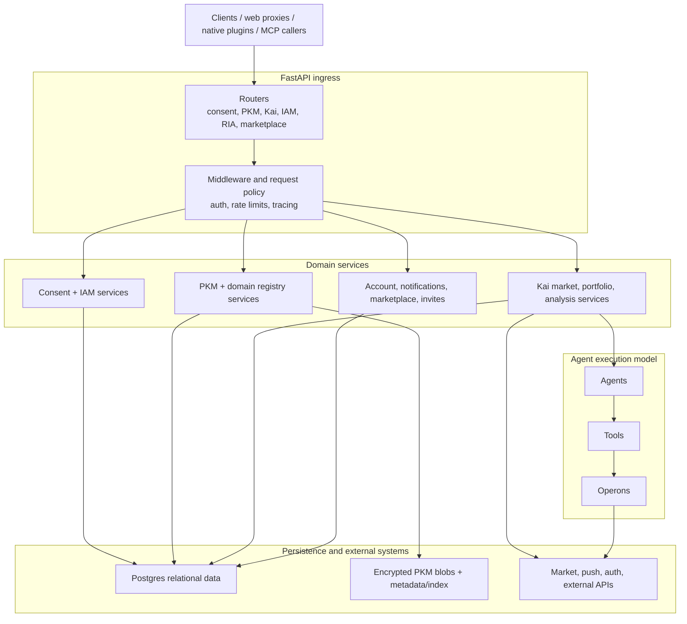

# Hushh Consent Protocol

> Consent-first backend for Hushh Personal Data Agents. Python 3.13 / FastAPI / Google ADK / Supabase.


## Visual Map



[](https://github.com/hushh-labs/consent-protocol/actions/workflows/ci.yml)

---

## What This Is

The Consent Protocol is the single source of truth for the Hushh backend. It powers:

- **Consent token issuance, validation, and revocation** -- cryptographically signed, stateless, auditable.
- **Personal Data Agents (PDAs)** -- built on Google ADK with consent enforcement at every layer.
- **Personal Knowledge Model (PKM)** -- segmented encrypted data architecture (BYOK). Server stores ciphertext only.
- **MCP Server** -- exposes user data to external AI agents (Claude, etc.) with explicit consent.
- **Agent Kai** -- multi-agent financial analysis system (Fundamental, Sentiment, Valuation) with debate engine.
- **FCM Push Notifications** -- pure-push consent request delivery (web, iOS, Android).

---

## Quick Start

If you are working inside the `hushh-research` monorepo, use the repo-root bootstrap and runtime profiles instead of manually assembling backend env files:

```bash
cd ..
./bin/hushh bootstrap
./bin/hushh terminal backend --mode local --reload
```

Standalone subtree/backend-only setup:

```bash
# Clone
git clone https://github.com/hushh-labs/consent-protocol.git
cd consent-protocol

# Install backend toolchain
uv sync --frozen --group dev

# Configure environment
cp .env.example .env
# Edit .env with your Supabase, Gemini, and Firebase credentials

# Run server
./bin/consent-protocol dev
```

Health check: `curl http://localhost:8000/health`

**Available commands:** Run `./bin/consent-protocol --help` to see the supported standalone backend commands.

## Using This In a Host Monorepo

If your frontend/backend live in one monorepo and this repository is vendored as a subtree, use the shared monorepo toolkit in `ops/monorepo/`.

See: [docs/monorepo-integration.md](docs/monorepo-integration.md)

## MCP Distribution

The preferred public install surface for the Hushh Consent MCP server is the npm launcher package `@hushh/mcp`, which bootstraps the existing Python stdio server and keeps the protocol logic in this repo. Repo-local direct Python setup remains supported as a fallback for contributors and unpublished-package testing.

See:

- [docs/mcp-setup.md](docs/mcp-setup.md)
- [`../packages/hushh-mcp/README.md`](../packages/hushh-mcp/README.md)

---

## Architecture

```
User Request
    │
    ▼
FastAPI Routes (api/routes/)
    │
    ▼
Service Layer (validates consent, no direct DB)
    │
    ▼
DatabaseClient (SQLAlchemy + Supabase Session Pooler)
    │
    ▼
PostgreSQL (Supabase)
```

### The DNA Model (Agent Stack)

| Layer      | Responsibility                        | DB Access | Consent Check  |
| ---------- | ------------------------------------- | --------- | -------------- |
| **Agent**  | Orchestrate tools, enforce consent    | No        | At entry       |
| **Tool**   | LLM-callable function (`@hushh_tool`) | No        | Per invocation |
| **Operon** | Business logic (pure or impure)       | No        | If impure      |
| **Service**| Database operations                   | Yes       | Validated upstream |

---

## Directory Structure

```
consent-protocol/
├── server.py                     # FastAPI app, CORS, rate limiting
├── consent_db.py                 # DatabaseClient singleton
├── pyproject.toml                # Canonical dependency + tooling contract
├── uv.lock                       # Canonical locked Python dependency graph
├── requirements.txt              # Generated runtime artifact for MCP packaging
├── requirements-dev.txt          # Generated compatibility artifact
├── Dockerfile                    # Cloud Run container
├── .env.example                  # Environment variable template
│
├── api/
│   ├── middlewares/               # Rate limiting, auth helpers
│   └── routes/                    # All endpoint routers
│       ├── consent.py             # Consent token management
│       ├── pkm.py                 # Personal Knowledge Model CRUD
│       ├── notifications.py       # FCM push tokens
│       └── kai/                   # Kai financial agent routes
│
├── hushh_mcp/
│   ├── hushh_adk/                 # Security-wrapped Google ADK
│   │   ├── core.py                # HushhAgent base class
│   │   ├── tools.py               # @hushh_tool decorator
│   │   ├── context.py             # HushhContext (contextvars)
│   │   └── manifest.py            # AgentManifest + ManifestLoader
│   ├── agents/                    # Agent implementations
│   │   ├── orchestrator/          # Intent routing
│   │   └── kai/                   # Financial analysis agents
│   ├── operons/kai/               # Business logic (calculators, fetchers, LLM)
│   ├── services/                  # Database access layer
│   ├── consent/                   # Token crypto, scope helpers
│   └── config.py                  # Environment config
│
├── mcp_modules/                   # MCP server tools and resources
├── db/migrations/                 # Authoritative numbered release migrations
├── db/contracts/                  # Frozen vs integrated schema contracts
├── db/legacy/                     # Legacy/bootstrap SQL, never release authority
├── db/verify/                     # Read-only DB contract verification helpers
├── db/seeds/                      # Disposable local/UAT seed utilities
├── db/repair/                     # Historical repair scripts, not contributor setup
├── db/release_migration_manifest.json  # Authoritative ordered release lane
├── tests/                         # pytest test suite
│
└── docs/                          # Documentation
    ├── README.md                  # Docs entry point
    ├── manifesto.md               # Hushh philosophy
    ├── mcp-setup.md               # MCP technical companion
    └── reference/
        ├── agent-development.md   # DNA model, operons, contribution guide
        ├── personal-knowledge-model.md  # PKM architecture, BYOK
        ├── kai-agents.md          # 3-agent debate system
        ├── consent-protocol.md    # Token model and security
        └── fcm-notifications.md   # FCM push architecture
```

---

## Documentation

| Document | Description |
| -------- | ----------- |
| [docs/README.md](docs/README.md) | Documentation entry point |
| [docs/reference/agent-development.md](docs/reference/agent-development.md) | How to build agents and operons |
| [docs/reference/personal-knowledge-model.md](docs/reference/personal-knowledge-model.md) | PKM storage and retrieval architecture |
| [docs/reference/kai-agents.md](docs/reference/kai-agents.md) | Multi-agent financial analysis |
| [docs/reference/consent-protocol.md](docs/reference/consent-protocol.md) | Consent token lifecycle |
| [docs/reference/fcm-notifications.md](docs/reference/fcm-notifications.md) | FCM push notifications |
| [docs/mcp-setup.md](docs/mcp-setup.md) | MCP runtime and contributor-local technical companion |
| [docs/monorepo-integration.md](docs/monorepo-integration.md) | Host monorepo subtree + hook setup |
| [CONTRIBUTING.md](CONTRIBUTING.md) | Contribution guide |

---

## Linting and Testing

Standalone contributor contract:

- License: Apache-2.0
- Signoff: use `git commit -s`
- Python installs: `uv sync --frozen --group dev`

Checks:

```bash
./bin/consent-protocol ci
```

Migration authority:

- authoritative release lane: `db/migrations/` + `db/release_migration_manifest.json`
- legacy/bootstrap SQL and one-off maintenance scripts are not release authority
- see [`../docs/reference/operations/migration-governance.md`](../docs/reference/operations/migration-governance.md) when you need the cross-repo governance view

```bash
./bin/consent-protocol lint         # Lint with ruff
./bin/consent-protocol format       # Format code
./bin/consent-protocol typecheck    # Type check with mypy
./bin/consent-protocol test         # Run tests with pytest
./bin/consent-protocol security     # Security scan with bandit
./bin/consent-protocol ci           # Run all checks (same as CI)
```

All checks run automatically in CI on every PR to `main`.

---

## Deployment

Deploys to **Google Cloud Run** via GitHub Actions or manual:

```bash
gcloud run deploy consent-protocol \
  --source . \
  --region us-east1 \
  --port 8000 \
  --allow-unauthenticated
```

---

## Security Invariants

1. **BYOK** -- Vault keys never touch the server. Backend stores ciphertext only.
2. **Consent-First** -- All data access requires a valid consent token. No bypasses.
3. **Double Validation** -- Consent checked at agent entry AND at each tool invocation.
4. **Audit Everything** -- Every token operation recorded in `consent_audit`.

---

## Contributing

See [CONTRIBUTING.md](CONTRIBUTING.md) for the full guide. The short version:

1. Fork and clone
2. Create a feature branch
3. Run `ruff check . && mypy . && pytest` before submitting
4. Open a PR against `main`

---

## License

Apache-2.0
