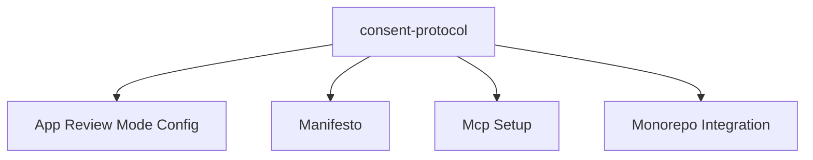

# consent-protocol

> Python FastAPI backend for the Hushh Consent Protocol, MCP server, and agent infrastructure.

## Visual Map

This directory is the package-local documentation home for backend and protocol contributors.

Use the package root README for:

- backend orientation
- package quick start
- runtime overview

Use this docs index for:

- backend reference navigation
- protocol concepts
- MCP/developer API docs
- package-local contributor docs

## Package Local Boundaries

This docs home owns:

- backend implementation reference
- consent protocol and PKM concepts
- agent and MCP documentation

It does not own:

- repo-wide contributor onboarding
- cross-cutting operations governance
- root documentation policy

## Documentation

| Goal | Document |
| ---- | -------- |
| Build a new agent or operon | [reference/agent-development.md](./reference/agent-development.md) |
| Publish against the developer API / MCP | [reference/developer-api.md](./reference/developer-api.md) |
| Understand data encryption and storage | [reference/personal-knowledge-model.md](./reference/personal-knowledge-model.md) |
| Learn the 3-agent debate system | [reference/kai-agents.md](./reference/kai-agents.md) |
| Understand the consent token model | [reference/consent-protocol.md](./reference/consent-protocol.md) |
| FCM push notification architecture | [reference/fcm-notifications.md](./reference/fcm-notifications.md) |
| Understand MCP runtime and contributor-local setup | [mcp-setup.md](./mcp-setup.md) |
| Integrate into a host monorepo (subtree) | [monorepo-integration.md](./monorepo-integration.md) |
| Read the Hushh philosophy | [manifesto.md](./manifesto.md) |

## Related Docs

- Package orientation: [../README.md](../README.md)
- Cross-cutting docs home: [../../docs/README.md](../../docs/README.md)
- Documentation governance: [../../docs/reference/operations/docs-governance.md](../../docs/reference/operations/docs-governance.md)
