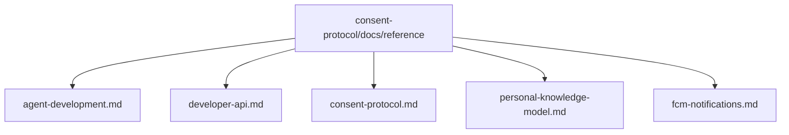

# consent-protocol Reference Index

## Visual Map

## Reference Documents

- [agent-development.md](./agent-development.md): agent, tool, operon, and service development model
- [backend-semantic-baseline-audit.md](./backend-semantic-baseline-audit.md): backend semantic audit reference
- [backend-semantic-boundary.md](./backend-semantic-boundary.md): backend semantic boundary contract
- [consent-protocol.md](./consent-protocol.md): consent-token lifecycle and trust model
- [developer-api.md](./developer-api.md): developer API and MCP-facing contract
- [env-vars.md](./env-vars.md): backend environment reference
- [fcm-notifications.md](./fcm-notifications.md): push notification delivery model
- [kai-agents.md](./kai-agents.md): Kai backend and agent system reference
- [personal-knowledge-model.md](./personal-knowledge-model.md): PKM model and storage architecture
- [pkm-agent-north-star.md](./pkm-agent-north-star.md): PKM agent north-star reference
- [pkm-prompt-contract.md](./pkm-prompt-contract.md): PKM prompt contract
- [pkm-structure-agent-live-eval.md](./pkm-structure-agent-live-eval.md): PKM structure evaluation notes
