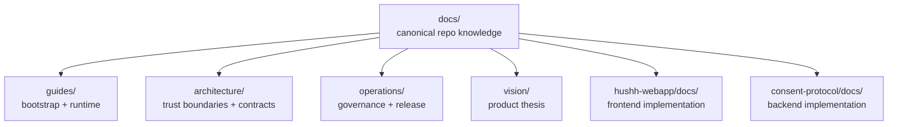

# Hushh Documentation

> Canonical entry point for durable repo knowledge.

## Visual Map

## The Story in One Screen

Hushh is a consent-and-scope platform built on a strict trust model:

- **identity** decides who is acting
- **vault** holds encrypted user data
- **scoped tokens** define what can be accessed
- **agents and apps** operate only inside granted consent boundaries

The platform invariants are:

1. **BYOK**
2. **zero-knowledge**
3. **consent + scoped access**
4. **tri-flow parity across web, iOS, and Android**

## Documentation Surface

Start here:

- [../README.md](../README.md): product and repo orientation
- [guides/getting-started.md](./guides/getting-started.md): first-run path
- [guides/environment-model.md](./guides/environment-model.md): runtime profiles
- [reference/operations/documentation-architecture-map.md](./reference/operations/documentation-architecture-map.md): canonical docs-home map
- [reference/architecture/architecture.md](./reference/architecture/architecture.md): runtime and trust boundaries
- [reference/operations/branch-governance.md](./reference/operations/branch-governance.md): delivery model
- [vision/README.md](./vision/README.md): product thesis and positioning

## Domain Indexes

| Domain | Index |
| ---- | ---- |
| Guides | [guides/README.md](./guides/README.md) |
| Architecture | [reference/architecture/README.md](./reference/architecture/README.md) |
| AI | [reference/ai/README.md](./reference/ai/README.md) |
| IAM | [reference/iam/README.md](./reference/iam/README.md) |
| Kai | [reference/kai/README.md](./reference/kai/README.md) |
| Mobile | [reference/mobile/README.md](./reference/mobile/README.md) |
| Operations | [reference/operations/README.md](./reference/operations/README.md) |
| Quality | [reference/quality/README.md](./reference/quality/README.md) |
| Streaming | [reference/streaming/README.md](./reference/streaming/README.md) |
| Vision | [vision/README.md](./vision/README.md) |

## Implementation Indexes

| Code domain | Index |
| ---- | ---- |
| Frontend/native package docs | [../hushh-webapp/docs/README.md](../hushh-webapp/docs/README.md) |
| App UI shell and shared surfaces | [../hushh-webapp/components/app-ui/README.md](../hushh-webapp/components/app-ui/README.md) |
| Consent UI and launchers | [../hushh-webapp/components/consent/README.md](../hushh-webapp/components/consent/README.md) |
| Kai investor surfaces | [../hushh-webapp/components/kai/README.md](../hushh-webapp/components/kai/README.md) |
| RIA surfaces | [../hushh-webapp/components/ria/README.md](../hushh-webapp/components/ria/README.md) |
| Service layer and platform-aware calls | [../hushh-webapp/lib/services/README.md](../hushh-webapp/lib/services/README.md) |
| Backend implementation docs | [../consent-protocol/docs/README.md](../consent-protocol/docs/README.md) |

## Documentation Homes

This repo uses a strict documentation-home model:

1. root markdowns stay thin and point downward
2. `docs/` owns cross-cutting repo contracts
3. `consent-protocol/docs/` owns backend/protocol package docs
4. `hushh-webapp/docs/` owns frontend/native package docs

See [reference/operations/documentation-architecture-map.md](./reference/operations/documentation-architecture-map.md).

## Active Docs Contract

Contributor-facing docs should stay small and stable:

- use one canonical setup path
- use the canonical public command surface (`bin/hushh` at repo root, package-local commands only when the doc is package-local)
- keep maintainer-only workflows out of first-run guides
- prefer durable references over one-time runbooks

Maintainer and implementation detail can still live deeper in the tree, but the default contributor experience should not require repo archaeology.
