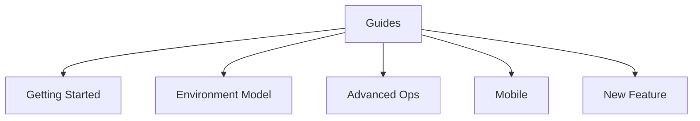

# Guides Index

Practical contributor guides live here.

## Visual Map

## Canonical Guides

- [getting-started.md](./getting-started.md): the only supported first-run path.
- [environment-model.md](./environment-model.md): the three supported runtime modes.
- [advanced-ops.md](./advanced-ops.md): deeper operator and release workflows.
- [mobile.md](./mobile.md): native/mobile operating model.
- [new-feature.md](./new-feature.md): implementation checklist when adding product surface.

## Deeper Guides

- [native_streaming.md](./native_streaming.md): native streaming workflow details.
- [plaid-activation-and-testing.md](./plaid-activation-and-testing.md): Plaid activation and sandbox/live testing.

Subtree synchronization is no longer part of the normal contributor guide surface. Maintainer-only sync notes now belong under operations.
