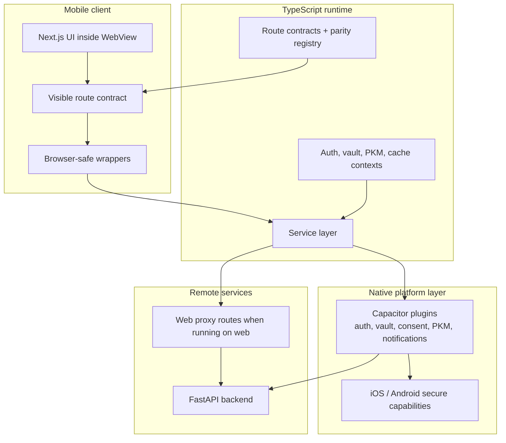

# Mobile Development (iOS & Android)

> Native mobile deployment with Capacitor 8 and local-first architecture.
> Last verified: March 2026.


## Visual Map



---

## Overview

The Hushh mobile app uses **Next.js static export** in a native WebView, with **native plugins** handling security-critical operations. Both iOS and Android achieve feature parity through aligned plugin implementations.

Program parity is enforced against the **entire visible route tree**, not only Kai core pages. The source of truth is:

- `hushh-webapp/route-contracts.json`
- `hushh-webapp/mobile-parity-registry.json`

Every visible page route must be classified as native-supported or explicitly exempt, and browser-sensitive behavior must either run through shared wrappers or be documented as an accepted exception.

### Dev mode (hot reload) vs plugin parity

- The **WebView UI** can point to a running `next dev` server for hot reload.
- **Native plugins must always call the Python backend** (FastAPI) via `NEXT_PUBLIC_BACKEND_URL` for parity with production.
- Next.js `app/api/**` routes are treated as **web-only proxy routes**; native plugins are the proxy layer on mobile.

Recommended commands:

- Terminal A (repo root): `npm run backend`
- Terminal B (repo root):
  - Android: `npm run native:android -- --mode local --fresh`
  - iOS: `npm run native:ios -- --mode local --fresh`

Required env:

- `NEXT_PUBLIC_BACKEND_URL` must point to your dev/staging Python backend.
  - If you use a local backend on your host machine, remember Android emulator needs `10.0.2.2` instead of `localhost`.
  - The runtime mode launcher handles that rewrite automatically in `capacitor.config.ts` for Android when the active mode uses localhost.

### Passkey domain association (production)

Passkeys for native apps require domain association files served at:

- `/.well-known/apple-app-site-association`
- `/.well-known/assetlinks.json`

This repo now serves both from Next.js route handlers:

- `hushh-webapp/app/.well-known/apple-app-site-association/route.ts`
- `hushh-webapp/app/.well-known/assetlinks.json/route.ts`

Required configuration:

- `APPLE_TEAM_ID` (or `NEXT_PUBLIC_APPLE_TEAM_ID`)
- `NEXT_PUBLIC_IOS_BUNDLE_ID` (default `com.hushh.app`)
- `ANDROID_SHA256_CERT_FINGERPRINTS` (comma-separated SHA-256)
- `NEXT_PUBLIC_ANDROID_APP_ID` (default `com.hushh.app`)
- Backend allowlist: `PASSKEY_ALLOWED_RP_IDS` in `consent-protocol/.env`

Notes:

- For dual-domain migration, keep both production hosts in `PASSKEY_ALLOWED_RP_IDS`.
- Keep `NEXT_PUBLIC_PASSKEY_RP_ID` unset for dual-domain web behavior (host-based RP ID).
- `localhost` is valid for web dev passkeys, but not for iOS associated domains.
- Native PRF passkey status:
  - iOS: implemented via `HushhVault.registerPasskeyPrf/authenticatePasskeyPrf` (requires iOS 18+).
  - Android: implemented via the native `HushhVault` passkey PRF bridge on supported devices.
- Vault preference/native fallback status:
  - `storePreferencesToCloud()` is the canonical shipped cross-platform path for encrypted preference writes.
  - Legacy local preference CRUD methods remain compatibility-only and are not part of the parity-critical product contract.

### Full parity audit lane

Before calling iOS/Android parity complete, run:

- `cd hushh-webapp && npm run verify:capacitor:audit`

That release gate includes:

- full route-contract verification
- native plugin parity verification
- Capacitor route classification verification
- Capacitor runtime config verification
- mobile Firebase artifact verification
- docs/runtime parity verification
- browser-API/native compatibility audit
- iOS project sanity (`xcodebuild -list`)
- Android project sanity (`./gradlew tasks --all`)

Accepted parity exceptions currently documented in the registry:

- None. Full parity requires the registry and runtime to stay exception-free for visible route behavior.
- Registry-backed direct usage that remains intentional must still be documented in `mobile-parity-registry.json`, especially for route recovery/navigation mutation and IndexedDB-backed cache services.

### Firebase artifact safety (no secret leak in git)

- `hushh-webapp/android/app/google-services.json` is committed as a template placeholder.
- Real artifacts should be injected at build time with:
  - `npm run inject:mobile-firebase`
- Root-level local files like `google-services.json` are ignored and must remain untracked.

```
┌────────────────────────────────────────────────────────────────┐
│              CAPACITOR MOBILE APP (iOS/Android)                │
├────────────────────────────────────────────────────────────────┤
│  ┌──────────────────────────────────────────────────────────┐  │
│  │           Native WebView (Next.js Static Export)         │  │
│  │  • React 19 + TailwindCSS UI                             │  │
│  │  • Morphy-UX components                                  │  │
│  └──────────────────────────────────────────────────────────┘  │
│                          ↓ Capacitor.call()                     │
│  ┌──────────────────────────────────────────────────────────┐  │
│  │       Native Plugins (10 per platform)                    │  │
│  │  HushhAuth · HushhVault · HushhConsent · Kai             │  │
│  │  HushhSync · HushhSettings · HushhKeystore · PKM         │  │
│  │  HushhAccount · HushhNotifications                       │  │
│  └──────────────────────────────────────────────────────────┘  │
│                          ↓ Native HTTP                          │
│  ┌──────────────────────────────────────────────────────────┐  │
│  │          Python Backend (Cloud Run)                       │  │
│  │  consent-protocol FastAPI with PostgreSQL                │  │
│  └──────────────────────────────────────────────────────────┘  │
└────────────────────────────────────────────────────────────────┘
```

---

## Native Plugins (10 Verified)

All 10 plugins exist on both platforms with matching methods:

| Plugin            | jsName          | Purpose                        | iOS                         | Android                  |
| ----------------- | --------------- | ------------------------------ | --------------------------- | ------------------------ |
| **HushhAuth**     | `HushhAuth`     | Google/Apple Sign-In, Firebase | `HushhAuthPlugin.swift`     | `HushhAuthPlugin.kt`     |
| **HushhVault**    | `HushhVault`    | Encryption, vault operations   | `HushhVaultPlugin.swift`    | `HushhVaultPlugin.kt`    |
| **HushhConsent**  | `HushhConsent`  | Token management, consent flow | `HushhConsentPlugin.swift`  | `HushhConsentPlugin.kt`  |
| **Kai**           | `Kai`           | Investment analysis agent      | `KaiPlugin.swift`           | `KaiPlugin.kt`           |
| **HushhSync**     | `HushhSync`     | Cloud synchronization          | `HushhSyncPlugin.swift`     | `HushhSyncPlugin.kt`     |
| **HushhSettings** | `HushhSettings` | App preferences                | `HushhSettingsPlugin.swift` | `HushhSettingsPlugin.kt` |
| **HushhKeystore** | `HushhKeychain` | Secure key storage             | `HushhKeystorePlugin.swift` | `HushhKeystorePlugin.kt` |
| **PKM**           | `PersonalKnowledgeModel` | Domain metadata/index access | `PersonalKnowledgeModelPlugin.swift` | `PersonalKnowledgeModelPlugin.kt` |
| **HushhAccount**  | `HushhAccount`  | Account lifecycle actions      | `HushhAccountPlugin.swift`  | `HushhAccountPlugin.kt`  |
| **HushhNotifications** | `HushhNotifications` | Push token registration | `HushhNotificationsPlugin.swift` | `HushhNotificationsPlugin.kt` |

> Note: HushhKeystore uses jsName `HushhKeychain` for historical compatibility.

## Route Coverage

Visible page routes are governed through `pageContracts[]` in `hushh-webapp/route-contracts.json`. That coverage includes:

- product routes (`/kai`, `/consents`, `/profile`, `/marketplace`, `/ria`)
- `/developers`
- public/auth content pages (`/`, `/login`, `/logout`)
- visible lab routes
- redirect-only compatibility pages that still ship in the app shell

Do not add a visible route without:

1. adding it to `pageContracts[]`
2. classifying it in `mobile-parity-registry.json`
3. ensuring its route-facing browser APIs are wrapped or explicitly exempted

---

## Key Methods by Plugin

### HushhAuth

| Method               | Description                                           |
| -------------------- | ----------------------------------------------------- |
| `signInWithGoogle()` | Native Google Sign-In → Firebase credential           |
| `signInWithApple()`  | Native Apple Sign-In (iOS) / Firebase OAuth (Android) |
| `signOut()`          | Clear all auth state                                  |
| `getIdToken()`       | Get cached/fresh Firebase ID token                    |
| `getCurrentUser()`   | Get user profile                                      |
| `isSignedIn()`       | Check auth state                                      |

Native auth persistence note:

- Native auth tokens are stored through secure platform storage (`Keychain` on iOS, `Keystore`-backed secure storage on Android), not general app defaults or browser storage.
- Web continues to rely on the browser/Firebase session model; native must preserve the same product semantics through the plugin boundary.

### HushhVault

| Method                   | Description                      |
| ------------------------ | -------------------------------- |
| `hasVault()`             | Check if vault exists for user   |
| `getVault()`             | Get full vault state + wrappers  |
| `setupVault()`           | Initialize/replace vault state   |
| `upsertVaultWrapper()`   | Add/update one method wrapper    |
| `setPrimaryVaultMethod()`| Set default unlock method        |
| `getFoodPreferences()`   | Get encrypted food preferences   |
| `storeFoodPreferences()` | Store encrypted food preferences |
| `getProfessionalData()`  | Get encrypted professional data  |

Session-storage semantics note:

- On native cold start, browser session storage semantics are restored by `lib/utils/session-storage.ts`.
- When the native WebView falls back to persistent storage, `_session_` keys are purged on boot so session-only state does not leak across fresh app launches.

### HushhConsent

| Method                   | Description                            |
| ------------------------ | -------------------------------------- |
| `issueToken()`           | Issue consent token locally            |
| `validateToken()`        | Validate token signature/expiry        |
| `revokeToken()`          | Revoke consent token                   |
| `issueVaultOwnerToken()` | Request VAULT_OWNER token from backend |
| `getPending()`           | Get pending consent requests           |
| `getActive()`            | Get active consents                    |
| `getHistory()`           | Get consent audit history              |
| `approve()`              | Approve pending consent                |
| `deny()`                 | Deny pending consent                   |
| `createTrustLink()`      | Create A2A delegation link             |
| `verifyTrustLink()`      | Verify TrustLink signature             |

### Kai

| Method                 | Description               |
| ---------------------- | ------------------------- |
| `analyze()`            | Start investment analysis |
| `getDecisionHistory()` | Get past decisions        |
| `stream()`             | Stream analysis with SSE  |

### HushhSync

| Method            | Description              |
| ----------------- | ------------------------ |
| `syncToCloud()`   | Sync local data to cloud |
| `syncFromCloud()` | Pull data from cloud     |

### HushhSettings

| Method                  | Description             |
| ----------------------- | ----------------------- |
| `get()`                 | Get setting value       |
| `set()`                 | Set setting value       |
| `remove()`              | Remove setting          |
| `getCloudSyncEnabled()` | Check cloud sync status |

### HushhKeystore (jsName: HushhKeychain)

| Method               | Description           |
| -------------------- | --------------------- |
| `setSecureItem()`    | Store secure value    |
| `getSecureItem()`    | Retrieve secure value |
| `removeSecureItem()` | Delete secure value   |

---

## File Structure

### iOS

```
ios/App/App/
├── AppDelegate.swift           # Firebase.configure()
├── MyViewController.swift      # Plugin registration
└── Plugins/
    ├── HushhAccountPlugin.swift
    ├── HushhAuthPlugin.swift
    ├── HushhConsentPlugin.swift
    ├── HushhKeystorePlugin.swift
    ├── HushhNotificationsPlugin.swift
    ├── HushhProxyClient.swift
    ├── HushhSettingsPlugin.swift
    ├── HushhSyncPlugin.swift
    ├── HushhVaultPlugin.swift
    ├── KaiPlugin.swift
    └── PersonalKnowledgeModelPlugin.swift
```

### Android

```
android/app/src/main/java/com/hushh/app/
├── MainActivity.kt             # Plugin registration
└── plugins/
    ├── HushhAccount/HushhAccountPlugin.kt
    ├── HushhAuth/HushhAuthPlugin.kt
    ├── HushhConsent/HushhConsentPlugin.kt
    ├── HushhKeystore/HushhKeystorePlugin.kt
    ├── HushhNotifications/HushhNotificationsPlugin.kt
    ├── HushhSettings/HushhSettingsPlugin.kt
    ├── HushhSync/HushhSyncPlugin.kt
    ├── HushhVault/HushhVaultPlugin.kt
    ├── Kai/KaiPlugin.kt
    ├── PersonalKnowledgeModel/PersonalKnowledgeModelPlugin.kt
    └── shared/BackendUrl.kt
```

### TypeScript Layer

```
lib/
├── capacitor/
│   ├── index.ts          # Plugin registration & interfaces
│   ├── types.ts          # Type definitions
│   └── plugins/          # Web fallbacks
│       ├── agent-web.ts
│       ├── auth-web.ts
│       ├── consent-web.ts
│       ├── database-web.ts
│       ├── kai-web.ts
│       ├── keychain-web.ts
│       ├── notifications-web.ts
│       ├── sync-web.ts
│       ├── settings-web.ts
│       ├── vault-web.ts
│       └── pkm web compatibility bridge
└── services/
    ├── api-service.ts    # Platform-aware API routing
    ├── auth-service.ts   # Native auth abstraction
    ├── vault-service.ts  # Vault operations
    └── kai-service.ts    # Kai agent service
```

---

## Plugin Registration

Every plugin must be registered in **both** iOS and Android registration files. Missing registration causes silent runtime failures when TypeScript calls the plugin on native platforms.

### iOS (Capacitor 8)

```swift
// ios/App/App/MyViewController.swift
class MyViewController: CAPBridgeViewController {
    override open func capacitorDidLoad() {
        super.capacitorDidLoad()
        bridge?.registerPluginInstance(HushhAuthPlugin())
        bridge?.registerPluginInstance(HushhVaultPlugin())
        bridge?.registerPluginInstance(HushhConsentPlugin())
        bridge?.registerPluginInstance(KaiPlugin())
        bridge?.registerPluginInstance(HushhSyncPlugin())
        bridge?.registerPluginInstance(HushhSettingsPlugin())
        bridge?.registerPluginInstance(HushhKeystorePlugin())
        bridge?.registerPluginInstance(PersonalKnowledgeModelPlugin())
        bridge?.registerPluginInstance(HushhAccountPlugin())
        bridge?.registerPluginInstance(HushhNotificationsPlugin())
    }
}
```

### Adding new iOS source files (project.pbxproj)

When adding a new Swift file to the app (e.g. a new plugin), you must add it to the Xcode project. If you edit `ios/App/App.xcodeproj/project.pbxproj` manually:

- **Every file reference and build file ID must be exactly 24 hexadecimal characters** (`0-9`, `A-F` only). No other characters are valid.
- Invalid IDs (e.g. containing `W`, `M`, `P`, `L`, `U`, `G`) cause Xcode errors like **"invalid hex digit"** and prevent the project from loading or building.
- Each new source file needs: (1) a `PBXFileReference` with a 24-hex ID, and (2) a `PBXBuildFile` entry in the app target’s Sources phase with a different 24-hex ID. Add the file reference to the Plugins group and the build file to the Sources build phase.
- Prefer adding the file in Xcode (File → Add Files) so it generates valid IDs; if editing `project.pbxproj` by hand, copy the ID format from existing entries (e.g. `A1B2C3D42F0E966A009FC3FD`).

### Android

```kotlin
// android/app/src/main/java/com/hushh/app/MainActivity.kt
class MainActivity : BridgeActivity() {
    override fun onCreate(savedInstanceState: Bundle?) {
        registerPlugin(HushhAuthPlugin::class.java)
        registerPlugin(HushhVaultPlugin::class.java)
        registerPlugin(HushhConsentPlugin::class.java)
        registerPlugin(HushhSyncPlugin::class.java)
        registerPlugin(HushhSettingsPlugin::class.java)
        registerPlugin(HushhKeystorePlugin::class.java)
        registerPlugin(HushhNotificationsPlugin::class.java)
        registerPlugin(KaiPlugin::class.java)
        registerPlugin(PersonalKnowledgeModelPlugin::class.java)
        registerPlugin(HushhAccountPlugin::class.java)
        super.onCreate(savedInstanceState)
    }
}
```

---

## Platform Comparison

| Feature           | Web         | iOS Native      | Android Native |
| ----------------- | ----------- | --------------- | -------------- |
| **Cloud Vault**   | Yes         | Yes             | Yes            |
| **Sign-In**       | Firebase JS | HushhAuth.swift | HushhAuth.kt   |
| **HTTP Client**   | fetch()     | URLSession      | OkHttpClient   |
| **Vault Storage** | Web Crypto  | Keychain        | Keystore       |
| **Biometric**     | No          | FaceID/TouchID  | Fingerprint    |

---

## Service Abstraction Pattern

TypeScript services route to native plugins or web APIs based on platform:

```typescript
// lib/services/vault-service.ts
import { Capacitor } from "@capacitor/core";
import { HushhVault } from "@/lib/capacitor";

export class VaultService {
  static async getFoodPreferences(userId: string): Promise<FoodPreferences> {
    if (Capacitor.isNativePlatform()) {
      // Native: Use Capacitor plugin → calls Python backend directly
      return HushhVault.getFoodPreferences({ userId });
    }
    // Web: Use Next.js API route
    return apiFetch(`/api/vault/food/preferences?userId=${userId}`);
  }
}
```

---

## snake_case to camelCase Transformation (CRITICAL)

Native plugins (iOS/Android) call the Python backend directly and receive raw JSON responses with **snake_case** keys. The service layer MUST transform these to **camelCase** before returning to React components.

### Why This Is Required

- Python backend uses snake_case (PEP 8 convention)
- TypeScript/React uses camelCase (JavaScript convention)
- Native plugins pass through raw JSON without transformation
- Web proxy routes (Next.js) also return snake_case from backend

### Required Pattern

```typescript
// lib/services/example-service.ts
if (Capacitor.isNativePlatform()) {
  const nativeResult = await Plugin.method({ userId });
  // Transform snake_case to camelCase
  // eslint-disable-next-line @typescript-eslint/no-explicit-any
  const raw = nativeResult as any;
  return {
    userId: raw.user_id || raw.userId,
    displayName: raw.display_name || raw.displayName,
    totalCount: raw.total_count || raw.totalCount || 0,
  };
}
```

### Plugins Requiring Transformation

| Plugin     | Methods                                                                     | Status                    |
| ---------- | --------------------------------------------------------------------------- | ------------------------- |
| PersonalKnowledgeModel | getMetadata, getAttributes, getUserDomains, listDomains, getAvailableScopes | Required |
| Kai        | getInitialChatState, chat                                                   | Required                  |
| Identity   | autoDetect, getIdentityStatus, getEncryptedProfile                          | Required                  |
| Vault      | All crypto methods                                                          | Not needed (simple types) |
| Consent    | Token methods                                                               | Not needed (simple types) |

---

## API Routes Require Native Plugins

> **IMPORTANT:** Every Next.js `/api` route that needs to work on iOS/Android MUST have a corresponding native Capacitor plugin implementation.

### Why This Is Required

Next.js `/api` routes run on a Node.js server. When the app is deployed as a Capacitor native app, there is **no server** - the app is a static bundle in a WebView:

```
❌ Native: fetch("/api/vault/food") → FAILS - No server available!
✅ Native: HushhVault.getFoodPreferences() → Native plugin → Python backend
```

### Mandatory 5-Step Workflow

When adding any new API feature:

| Step | Location                      | Action                              |
| ---- | ----------------------------- | ----------------------------------- |
| 1    | `app/api/.../route.ts`        | Create Next.js API route (web only) |
| 2    | `lib/capacitor/index.ts`      | Add TypeScript interface            |
| 3    | `android/.../Plugin.kt`       | Implement Kotlin method             |
| 4    | `ios/.../Plugin.swift`        | Implement Swift method              |
| 5    | `lib/services/...-service.ts` | Add platform-aware routing          |

### Platform-Aware ApiService Pattern

```typescript
// lib/services/api-service.ts
import { Capacitor } from "@capacitor/core";

export class ApiService {
  static async approvePendingConsent(data: {
    userId: string;
    requestId: string;
  }): Promise<Response> {
    if (Capacitor.isNativePlatform()) {
      // Native: Use Capacitor plugin → calls Python backend directly
      const { HushhConsent } = await import("@/lib/capacitor");
      await HushhConsent.approve({
        requestId: data.requestId,
        userId: data.userId,
      });
      return new Response(JSON.stringify({ success: true }), { status: 200 });
    }
    // Web: Use Next.js API route
    return fetch("/api/consent/pending/approve", {
      method: "POST",
      body: JSON.stringify(data),
    });
  }
}
```

---

## Endpoint Mapping

Native plugins call Python backend directly, bypassing Next.js:

| Operation        | Native (Swift/Kotlin)                | Web (Next.js)                             | Backend |
| ---------------- | ------------------------------------ | ----------------------------------------- | ------- |
| Vault Check      | `POST /db/vault/check`               | `GET /api/vault/check`                    | Python  |
| Vault Get        | `POST /db/vault/get`                 | `GET /api/vault/get`                      | Python  |
| Vault Setup      | `POST /db/vault/setup`               | `POST /api/vault/setup`                   | Python  |
| Vault Wrapper Upsert | `POST /db/vault/wrapper/upsert`   | `POST /api/vault/wrapper/upsert`          | Python  |
| Vault Primary Set | `POST /db/vault/primary/set`        | `POST /api/vault/primary/set`             | Python  |
| Food Get         | `POST /api/food/preferences`         | `GET /api/vault/food/preferences`         | Python  |
| Professional Get | `POST /api/professional/preferences` | `GET /api/vault/professional/preferences` | Python  |
| Consent Pending  | `POST /api/consent/pending`          | `GET /api/consent/pending`                | Python  |
| Consent Active   | `POST /api/consent/active`           | `GET /api/consent/active`                 | Python  |
| Consent History  | `POST /api/consent/history`          | `GET /api/consent/history`                | Python  |

### Backend URLs

| Mode       | URL                                                          |
| ---------- | ------------------------------------------------------------ |
| Production | `https://consent-protocol-1006304528804.us-central1.run.app` |
| Local Dev  | `http://localhost:8080`                                      |

Native plugins have `defaultBackendUrl` hardcoded to production. For local testing, pass `backendUrl` parameter.

---

## Build Commands

> **IMPORTANT:** ALWAYS perform a fresh build when modifying native code (Swift/Kotlin plugins).
> Stale DerivedData will cause native changes to be ignored.

### iOS (Fresh Build)

```bash
# 1. Clear Xcode cache (MANDATORY for native changes)
rm -rf ~/Library/Developer/Xcode/DerivedData/App-*

# 2. Build web assets and sync
npm run cap:build
npx cap sync ios

# 3. Clean build
xcodebuild -project ios/App/App.xcodeproj -scheme App clean build \
  -destination 'platform=iOS Simulator,name=iPhone 16' \
  -derivedDataPath ~/Library/Developer/Xcode/DerivedData/App-hushh

# 4. Install and launch
xcrun simctl install booted ~/Library/Developer/Xcode/DerivedData/App-hushh/Build/Products/Debug-iphonesimulator/App.app
xcrun simctl launch booted com.hushh.app
```

### Android (Fresh Build)

> **IMPORTANT:** Ensure `.env.local` contains the Production backend URL.
> `capacitor.config.ts` is configured to load this file.

```bash
# 1. Clean Gradle cache
cd android && ./gradlew clean && cd ..

# 2. Build web assets and sync
cross-env CAPACITOR_BUILD=true npm run build
npx cap sync android

# 3. Build and install
cd android && ./gradlew assembleDebug
adb install -r app/build/outputs/apk/debug/app-debug.apk
```

---

## Build Configuration

### next.config.ts

```typescript
// Web/Cloud Run: undefined (server mode with API routes)
// Capacitor/Mobile: "export" (static HTML, no API routes)
output: isCapacitorBuild ? "export" : undefined;
```

### capacitor.config.ts

```typescript
// For development: set to true to use localhost:3000 hot reload
// For production: set to false to use static build in /out
const DEV_MODE = false; // Must be false for production builds

const config: CapacitorConfig = {
  appId: "com.hushh.app",
  appName: "Hushh",
  webDir: "out",
  server: {
    cleartext: true,
    androidScheme: "https",
  },
};
```

**Production Checklist:**

- [ ] Set `DEV_MODE = false` in `capacitor.config.ts`
- [ ] Run `npm run cap:build` to create static export
- [ ] Run `npx cap sync` to copy assets to native projects
- [ ] Verify `capacitor.config.json` in native assets has no `url` in `server` section

---

## Device Requirements

| Requirement    | iOS     | Android              |
| -------------- | ------- | -------------------- |
| **Minimum OS** | iOS 16+ | Android 11+ (API 30) |
| **Target OS**  | iOS 18  | Android 14+          |

---

## Mobile UX Standards

### Navigation Architecture

The app follows a **Layered Navigation** model:

| Level  | Description | Examples                      | Back Button        |
| ------ | ----------- | ----------------------------- | ------------------ |
| **1**  | Root Tabs   | `/kai`, `/consents`, `/profile` | Exit/Lock Dialog |
| **2+** | Sub Pages   | `/kai/onboarding`, `/kai/import`, `/kai/portfolio` | Navigate to Parent |

### Exit Dialog Security

When users exit from root-level pages:

1. User clicks back button on root page
2. `NavigationProvider` detects `isRootLevel = true`
3. `ExitDialog` appears with security warning
4. On confirm:
   - Lock vault (clear encryption key from memory)
   - Clear session storage
   - Remove sensitive localStorage items
   - Exit app via Capacitor

### Layout & Safe Area

**Top bar (native and web):**

- System bars are controlled by the Capacitor `SystemBars` runtime manager (`components/status-bar-manager.tsx`) on native platforms.
- Capacitor config uses immersive edge-to-edge with CSS inset injection:
  - `ios.contentInset = "never"`
  - `plugins.SystemBars.insetsHandling = "css"`
- Root layout owns top geometry for all shell-visible routes:
  - `resolveTopShellMetrics(pathname)` sets route profile inputs.
  - `Providers` writes the CSS variables (`--app-top-shell-visible`, `--app-top-has-tabs`, `--app-top-mask-tail-clearance`).
  - A structural spacer uses `height: var(--app-top-content-offset)` so pages start below top chrome.
- Safe-area resolution is tokenized in CSS:
  - `--app-safe-area-top: var(--safe-area-inset-top, env(safe-area-inset-top, 0px))`
  - `--app-safe-area-top-effective` includes iOS max inset fallback.
- Do not use page-level `pt-*` hacks for notch/status-bar overlap fixes.

## Authentication Token Passing

**CRITICAL:** When components call services that require `vaultOwnerToken`, always pass it explicitly as a prop. Do not rely on sessionStorage fallback on native platforms.

```typescript
// Component receives vaultOwnerToken from context
const { vaultOwnerToken } = useVault();

// Pass to child components
<PortfolioReviewView
  vaultOwnerToken={vaultOwnerToken}
  // ... other props
/>

// Service call includes token
await PersonalKnowledgeModelService.storeDomainData({
  userId,
  domain: "financial",
  encryptedBlob: { ... },
  summary: { ... },
  vaultOwnerToken, // Explicitly passed
});
```

**Why:** Protected consent operations now require an explicit `vaultOwnerToken`; this avoids implicit storage reads and prevents intermittent auth failures across native webview lifecycles.

## Streaming Features

For Server-Sent Events (SSE) streaming on native:

- Use native plugins that emit events via `notifyListeners()`
- ApiService creates ReadableStream fed by plugin events
- Components process buffer after stream ends to catch final events
- See [Native Streaming Guide](./native_streaming.md) for complete patterns

## Testing Checklist

Before releasing mobile updates:

- [ ] All required plugins registered on both platforms (see `docs/reference/kai/mobile-kai-parity-map.md`)
- [ ] Firebase authentication works (Google Sign-In)
- [ ] Apple Sign-In works on iOS
- [ ] Vault operations work end-to-end
- [ ] Consent flow completes successfully
- [ ] Kai analysis streams correctly
- [ ] Streaming features complete and show results
- [ ] Save to vault works (vaultOwnerToken passed correctly)
- [ ] Backend URLs point to production
- [ ] Biometric prompts work correctly

---

## Static Export Redirect Limitations

For `CAPACITOR_BUILD=true` (`output: "export"`), treat App Router files as the only canonical route surface.

Required rule:
- Do not depend on legacy alias redirects for mobile navigation.
- Keep only canonical pages: `/`, `/login`, `/kai`, `/kai/onboarding`, `/kai/import`, `/kai/plaid/oauth/return`, `/kai/portfolio`.
- Any removed alias route must stay removed from both `app/` and `next.config.ts`.

---

## Capacitor E2E Verification (Hard-Fail)

Run from `hushh-webapp`:

```bash
npm run verify:capacitor:e2e
```

This runs:
1. `verify:routes`
2. `verify:parity`
3. `verify:mobile-firebase`
4. `cap:build:mobile`
5. `verify:capacitor:routes`

Expected outcome:
- All commands pass with exit code `0`.
- Any missing fallback route page, plugin method parity drift, or mobile artifact issue fails the gate immediately.

Manual smoke on device/simulator is still required after this CI gate.

---

_Last verified: March 2026 | Capacitor 8_
