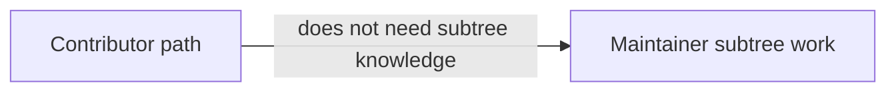

# Subtree Sync

This topic is now maintainer-only.

## Visual Context

Canonical visual owner: [Operations Index](../reference/operations/README.md). Use that map for the maintainer/operations view; this page is only a pointer.

## Visual Map



Normal contributors should use the monorepo-first flow:

```bash
npm run bootstrap
npm run web -- --mode=uat
```

If you are coordinating the `consent-protocol` upstream relationship, use:

- [../reference/operations/subtree-maintainers.md](../reference/operations/subtree-maintainers.md)
