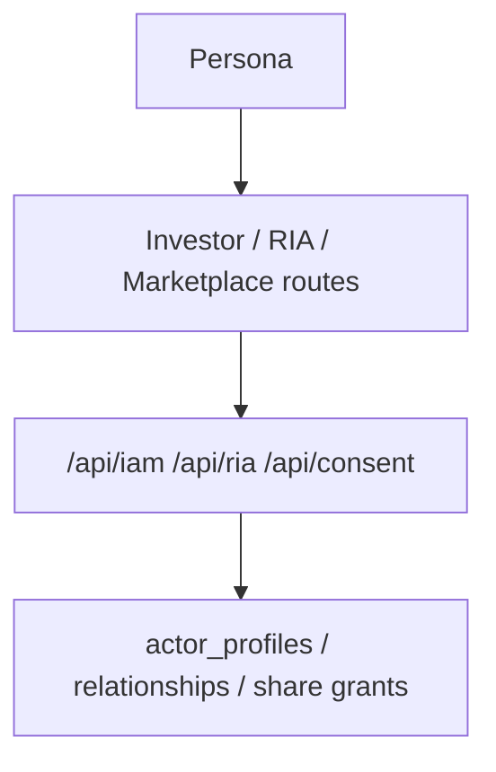

# Runtime Surface

## Visual Map

## Purpose

Describe the current implemented Investor + RIA runtime surface (backend + web + MCP).

## Runtime Contract

| Variable | Layer | Role |
| --- | --- | --- |
| `ENVIRONMENT` | backend | Canonical runtime environment identity (`development`, `uat`, `production`) |
| `NEXT_PUBLIC_APP_ENV` | frontend | Canonical client environment identity (`development`, `uat`, `production`) |

Compatibility fallback (temporary): frontend still accepts `NEXT_PUBLIC_OBSERVABILITY_ENV` and `NEXT_PUBLIC_ENVIRONMENT_MODE` if `NEXT_PUBLIC_APP_ENV` is unset.

## IAM Schema Compatibility Mode

1. IAM activation is migration-gated, not startup-mutated.
2. Run explicit commands:
   `python db/migrate.py --iam`
   `python scripts/verify_iam_schema.py`
3. If IAM schema is missing:
4. `GET /api/iam/persona` returns `200` investor-safe payload with:
   `iam_schema_ready=false`, `mode="compat_investor"`.
5. `POST /api/iam/persona/switch` allows `investor` and returns `503 IAM_SCHEMA_NOT_READY` for `ria`.
6. `/api/ria/*` and `/api/marketplace/*` return `503` with code `IAM_SCHEMA_NOT_READY`.

## Route Families

1. Investor routes remain under existing `/kai/*`, `/consents`, `/profile`.
2. RIA routes:
   1. `/ria/onboarding`
   2. `/ria/clients`
   3. `/ria/workspace?clientId=<investor_user_id>`
3. Compatibility aliases:
   1. `/ria/requests` -> `/consents?actor=ria&view=outgoing`
   2. `/ria/settings` -> `/profile?section=ria`
4. Marketplace route: `/marketplace`.

## Backend API Surface

### IAM

1. `GET /api/iam/persona`
2. `POST /api/iam/persona/switch`
3. `POST /api/iam/marketplace/opt-in`

### RIA

1. `POST /api/ria/onboarding/submit`
2. `GET /api/ria/onboarding/status`
3. `GET /api/ria/firms`
4. `GET /api/ria/clients`
5. `GET /api/ria/requests` (compatibility alias)
6. `POST /api/ria/requests` (compatibility alias)
7. `GET /api/ria/clients/{investor_user_id}`
8. `GET /api/ria/workspace/{investor_user_id}`
9. `GET /api/ria/invites`
10. `POST /api/ria/invites`

### Consent Center

1. `GET /api/consent/center` (compatibility read model)
2. `GET /api/consent/center/summary`
3. `GET /api/consent/center/list`
4. `GET /api/consent/requests/outgoing`
5. `POST /api/consent/requests`

Consent-center and scope-discovery payloads may include scope display metadata for user-facing presentation:

1. `scopeLabel`
2. `scopeDescription`
3. `scopeIconName`
4. `scopeColorHex`

These fields are presentation metadata only. Authorization still evaluates the canonical scope string.

Consent-manager surface rules:

1. `/consents` is the single shared consent-manager route for investor and RIA.
2. The active persona is the default actor for both the top-shell consent inbox and `/consents`.
3. The canonical page flow is `summary + one paginated list surface + detail panel`.
4. `GET /api/consent/center` is not on the main `/consents` critical path.
5. The top-shell shield is the consent inbox:
   - badge source: `summary.counts.pending`
   - preview rows: first `5` items from the cached `center/list?surface=pending&page=1&limit=20` payload for the active persona
6. Long consent lists must use backend-backed pagination metadata and must not rely on a load-all-then-slice page contract.

### Marketplace

1. `GET /api/marketplace/rias`
2. `GET /api/marketplace/investors`
3. `GET /api/marketplace/ria/{ria_id}`

## IAM Data Tables

1. `actor_profiles`
2. `ria_profiles`
3. `ria_firms`
4. `ria_firm_memberships`
5. `ria_verification_events`
6. `advisor_investor_relationships`
7. `ria_client_invites`
8. `consent_scope_templates`
9. `relationship_share_grants`
10. `relationship_share_events`
11. `marketplace_public_profiles`
12. `runtime_persona_state` (transitional compatibility only)

## Persona State Ownership

1. `actor_profiles.last_active_persona` is the canonical persisted persona state.
2. `runtime_persona_state` is used only for transitional setup continuity before an account fully earns the `ria` persona.
3. Full-mode persona responses must prefer `actor_profiles` and never let runtime state override a real dual-persona account.

## Consent Integration

1. RIA request creation writes `REQUESTED` rows into `consent_audit` with actor metadata.
2. Consent approve/deny/cancel/revoke actions synchronize relationship lifecycle.
3. Workspace access is blocked unless relationship is approved and consent is active/non-expired.
4. Approved RIA relationships implicitly materialize `ria_active_picks_feed_v1`, which lets Kai surface the advisor's active picks feed to the investor without a second prompt.
5. Relationship-share grants are tracked outside `consent_audit` because advisor picks are advisor-authored relationship content, not investor PKM.
6. Invite state is pre-consent workflow only; it is surfaced through the same consent-center read model but remains distinct from the canonical audit ledger.

## Relationship Share Integration

1. Investor private data flowing to an RIA stays on the shared `/consents` lane and `consent_audit`.
2. Advisor-authored content flowing back to the investor uses `relationship_share_grants` plus append-only `relationship_share_events`.
3. The initial implicit share is `ria_active_picks_feed_v1`.
4. Kai only exposes `ria:*` pick sources when both the relationship is approved and the picks-share grant is active.
5. Active uploads continue to update the entitled feed without requiring a fresh investor prompt.

## MCP Read-Only Tools

1. `list_ria_profiles`
2. `get_ria_profile`
3. `list_marketplace_investors`
4. `get_ria_verification_status`
5. `get_ria_client_access_summary`

These tools remain read-only in V1 and are gated by auth + consent + scope policy checks.
