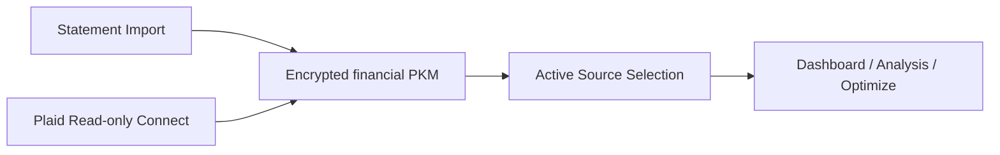

# Kai Brokerage Connectivity Architecture

## Visual Map

Canonical reference for how Kai handles brokerage connectivity today and how the model stays compatible with future broker execution.

## North Stars

- Consent before access and consent before action
- BYOK and memory-only sensitive state
- Tri-flow parity across web, iOS, and Android
- Low-friction investor answers, with debate remaining separate
- Clear provenance: editable statement data vs immutable broker-sourced data
- No capability overclaiming: Plaid is read-only connectivity, not trade execution

## Capability Boundary

### Current

- Statement import: editable
- Plaid: read-only holdings, accounts, investment transactions, refresh, OAuth resume
- Combined: comparison-only rollup, not a direct analysis or execution source

### Not Current

- live trade execution
- broker order placement
- auto-trading from debate or optimize

Future trade execution must use a separate broker-adapter layer and distinct consent/approval flows.

## Modularization Boundary

Current implementation shape is intentional:

- backend integration mechanics live under `hushh_mcp/integrations/plaid/`
- Kai-facing brokerage orchestration stays in `hushh_mcp/services/plaid_portfolio_service.py`
- agent-facing pure brokerage logic belongs in `hushh_mcp/operons/kai/brokerage.py`
- frontend brokerage runtime helpers live under `hushh-webapp/lib/kai/brokerage/`

This keeps Link/OAuth/webhook plumbing out of ADK/A2A/MCP while still giving Kai a clean brokerage context layer for future agent and execution work.

## Source Model

Kai exposes three portfolio views:

- `Statement`
  - editable
  - parser provenance and confidence preserved
- `Plaid`
  - immutable
  - broker-sourced freshness and sync status preserved
- `Combined`
  - read-only comparison view
  - overlap counts, source totals, and coverage
  - not a direct Debate or Optimize source

## Persistence Model

### Editable PKM contract

- `financial.sources.statement`
- `financial.sources.plaid`
- `financial.rollups.combined_summary`
- `financial.portfolio`
- `financial.analytics`

`financial.portfolio` and `financial.analytics` remain the app-consumed shape and are derived from the active source.

### Server-side Plaid storage

- `kai_plaid_items`
  - encrypted Plaid access token envelope
  - normalized accounts, holdings, securities, transactions
  - connection health and latest sync metadata
- `kai_plaid_refresh_runs`
  - refresh lifecycle and webhook-driven completion
- `kai_plaid_link_sessions`
  - short-lived OAuth resume sessions
- `kai_portfolio_source_preferences`
  - active source selection

Plaid access tokens never live in the PKM.

## OAuth and Web Callback Model

Callback path:

- `/kai/plaid/oauth/return`

Runtime rules:

1. Client requests a Link token with a frontend-derived absolute `redirect_uri`.
2. Backend validates the origin against `APP_FRONTEND_ORIGIN` and the path against `PLAID_REDIRECT_PATH`.
3. Backend persists an opaque `resume_session_id` in `kai_plaid_link_sessions`.
4. Browser stores only that opaque session id, never the vault key or a persisted vault token.
5. On return from the institution, Kai re-issues a fresh `VAULT_OWNER` token, fetches the stored Link token, resumes Link with `receivedRedirectUri`, exchanges the `public_token`, and clears the session.

## Refresh and Freshness

Manual refresh flow:

1. User clicks `Refresh`
2. Backend creates a refresh run
3. `/investments/refresh` when supported
4. Wait for `HOLDINGS: DEFAULT_UPDATE`
5. Pull fresh holdings and transactions
6. Update aggregate freshness + sync state

Fallback:

- If `/investments/refresh` is unsupported, Kai falls back to `holdings/get` and preserves stale/freshness messaging.

## Multiple Accounts and Institutions

Defaults:

- one user can have multiple Plaid Items
- one Item can have multiple investment accounts
- aggregation is additive, never overwrite-based
- update mode is used for reconnect and add-account flows

Identity rules:

- account identity: `item_id + account_id`
- relink anchor: `persistent_account_id` when present
- holding identity: `item_id + account_id + security_id`
- security churn fallback: `proxy_security_id`

## Debate and Optimize Context

Kai enriches the active source context with:

- holdings
- source metadata
- freshness/sync state
- investment transactions
- income, fee, and gain/loss summaries

Current guardrails:

- debate and optimize can run on `statement` or `plaid`
- combined requires explicit source selection first
- optimize remains fail-closed when realtime market dependencies are missing

## Future Broker Execution Shape

Execution-ready reserved contracts:

- `BrokerConnection`
- `ExecutionBroker`
- `ExecutionAccount`
- `OrderIntent`
- `OrderPreview`
- `ExecutionApproval`
- `ExecutionOrder`
- `ExecutionStatus`

Execution principles:

- broker-adapter based, not Plaid based
- explicit human approval by default
- audit logging and idempotency mandatory
- post-trade reconciliation writes back into the PKM as a separate source of truth
