# Operations Index

## Visual Map

```mermaid
flowchart TD
  root["Operations Index"]
  n1["Branch Governance"]
  root --> n1
  n2["Ci"]
  root --> n2
  n3["Root Cli"]
  root --> n3
  n4["Coding Agent Mcp"]
  root --> n4
  n5["Developer Access Matrix"]
  root --> n5
  n6["Docs Governance"]
  root --> n6
  n11["Documentation Architecture Map"]
  root --> n11
  n7["Env And Secrets"]
  root --> n7
  n8["Env Secrets Key Matrix"]
  root --> n8
  n9["Observability Google First"]
  root --> n9
  n12["Observability Architecture Map"]
  root --> n12
  n10["Production Db Backup And Recovery"]
  root --> n10
  n13["Observability Event Matrix"]
  root --> n13
  n14["Migration Governance"]
  root --> n14
```

Use this as the entrypoint for CI, docs governance, delivery, and environment operations.
One-time rollout notes belong in PRs, issues, or git history, not in the active operations surface.

## Codex OS

Use the root CLI for agent-first onboarding and deterministic workflow routing:

- `./bin/hushh codex onboard`
- `./bin/hushh codex list-workflows`
- `./bin/hushh codex route-task <workflow-id>`
- `./bin/hushh codex impact <workflow-id> [--path <repo-path>]`
- `./bin/hushh codex ci-status [--watch]`
- `./bin/hushh codex audit`

Repo governance baseline:

- Apache-2.0 for first-party code
- DCO signoff on PR commits
- `uv` as the canonical backend Python toolchain
- one required aggregate PR gate: `CI Status Gate`

## Codex skills

Top-level owner skills:

- `.codex/skills/repo-context/`: broad repository orientation, cross-domain routing, and full-repo coverage mapping.
- `.codex/skills/frontend/`: broad frontend intake across routes, components, services, and verification ownership.
- `.codex/skills/mobile-native/`: iOS, Android, Capacitor plugin, and mobile parity intake.
- `.codex/skills/backend/`: backend runtime, route, service, agent, and package-surface intake.
- `.codex/skills/security-audit/`: IAM, consent, trust, vault, PKM, streaming, and verification/audit intake.
- `.codex/skills/docs-governance/`: documentation homes, consolidation, maps, and docs verification policy.
- `.codex/skills/repo-operations/`: CI/CD, branch protection, deploys, env parity, and runtime operations.
- `.codex/skills/oss-license-governance/`: Apache-2.0 licensing, SPDX/REUSE, package metadata, and third-party notice governance.
- `.codex/skills/contributor-onboarding/`: bootstrap, devcontainer, doctor, and contributor-first-run ownership.
- `.codex/skills/subtree-upstream-governance/`: upstream-first coordination, subtree sync, and maintainer-only subtree policy.
- `.codex/skills/analytics-observability-governance/`: GA4/Firebase/BigQuery topology, growth dashboard verification, environment split, and observability contract ownership.
- `.codex/skills/planning-board/`: `Hushh Engineering Core` board workflows only.
- `.codex/skills/future-planner/`: future-state roadmap planning, R&D filtering, and promotion-boundary decisions.
- `.codex/skills/comms-community/`: public/community explanation workflows.
- `.codex/skills/codex-skill-authoring/`: repo-local skill creation, retrofit, linting, scaffolding, and taxonomy maintenance.

Specialist spoke skills live under the same tree and should be used after the correct owner skill or `repo-context` has narrowed the request.
Workflow packs under `.codex/workflows/` are the canonical recurring task surface for routing and onboarding.
Use `ci-watch-and-heal` plus `./bin/hushh codex ci-status` when the task depends on live PR checks or GitHub Actions state.

## References

- [ci.md](./ci.md): local/remote CI parity and required lanes.
- [cli.md](./cli.md): canonical root command surface for repo-level workflows.
- [branch-governance.md](./branch-governance.md): branch rules, review gates, and bypass policy.
- [documentation-architecture-map.md](./documentation-architecture-map.md): canonical docs-home map across root, cross-cutting docs, and package docs.
- [docs-governance.md](./docs-governance.md): documentation placement and quality gates.
- [env-and-secrets.md](./env-and-secrets.md): environment and secret contract.
- [env-secrets-key-matrix.md](./env-secrets-key-matrix.md): key-by-key environment matrix.
- [migration-governance.md](./migration-governance.md): canonical migration authority, frozen-vs-integrated DB contracts, and allowed SQL surfaces.
- [naming-policy.md](./naming-policy.md): Hushh public naming rules and compatibility boundaries.
- [developer-access-matrix.md](./developer-access-matrix.md): org-level developer IAM baseline, runtime identities, and DB access path.
- [observability-architecture-map.md](./observability-architecture-map.md): canonical analytics-plane and reporting-plane map.
- [observability-google-first.md](./observability-google-first.md): observability operating model.
- [observability-event-matrix.md](./observability-event-matrix.md): event taxonomy, emitter map, and dashboard contract.
- [production-db-backup-and-recovery.md](./production-db-backup-and-recovery.md): production DB recovery guide.
- [coding-agent-mcp.md](./coding-agent-mcp.md): MCP host operations for local engineering environments.
- [subtree-maintainers.md](./subtree-maintainers.md): maintainer-only subtree sync and upstream coordination.
- [`../../../consent-protocol/scripts/README.md`](../../../consent-protocol/scripts/README.md): maintainer-only backend script map and when to use it.
