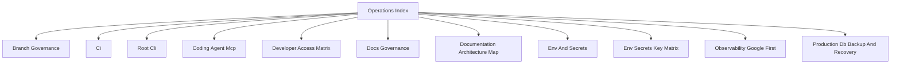

# Operations Index

## Visual Map

Use this as the entrypoint for CI, docs governance, delivery, and environment operations.
One-time rollout notes belong in PRs, issues, or git history, not in the active operations surface.

## Codex skills

- `.codex/skills/devops-operations/`: use for CI/CD, branch protection, merge queue, deploy, env or secret parity, Cloud Run or Cloud Build operations, and operational verification.
  It is also the canonical skill for PR approval/admin-bypass decisions and must verify live GitHub identity plus ruleset state before acting.
  After merges or deploy triggers, it must continue monitoring the resulting CI/deploy runs until they finish or fail with a concrete blocker.
  For failures inside the operations surface, it should attempt the fix-and-rerun loop instead of stopping at diagnosis.
- `.codex/skills/github-board-operations/`: use for `Hushh Engineering Core` GitHub board workflows only.
- `.codex/skills/documentation-governance/`: use for doc placement, consolidation, diagrams, docs verification, and canonical docs-home decisions.
- frontend skills under `.codex/skills/` are not the right path for repository operations or delivery work.

## References

- [ci.md](./ci.md): local/remote CI parity and required lanes.
- [cli.md](./cli.md): canonical root command surface for repo-level workflows.
- [branch-governance.md](./branch-governance.md): branch rules, review gates, and bypass policy.
- [documentation-architecture-map.md](./documentation-architecture-map.md): canonical docs-home map across root, cross-cutting docs, and package docs.
- [docs-governance.md](./docs-governance.md): documentation placement and quality gates.
- [env-and-secrets.md](./env-and-secrets.md): environment and secret contract.
- [env-secrets-key-matrix.md](./env-secrets-key-matrix.md): key-by-key environment matrix.
- [naming-policy.md](./naming-policy.md): Hushh public naming rules and compatibility boundaries.
- [developer-access-matrix.md](./developer-access-matrix.md): org-level developer IAM baseline, runtime identities, and DB access path.
- [observability-google-first.md](./observability-google-first.md): observability operating model.
- [production-db-backup-and-recovery.md](./production-db-backup-and-recovery.md): production DB recovery guide.
- [coding-agent-mcp.md](./coding-agent-mcp.md): MCP host operations for local engineering environments.
- [subtree-maintainers.md](./subtree-maintainers.md): maintainer-only subtree sync and upstream coordination.
- [`../../../consent-protocol/scripts/README.md`](../../../consent-protocol/scripts/README.md): maintainer-only backend script map and when to use it.
