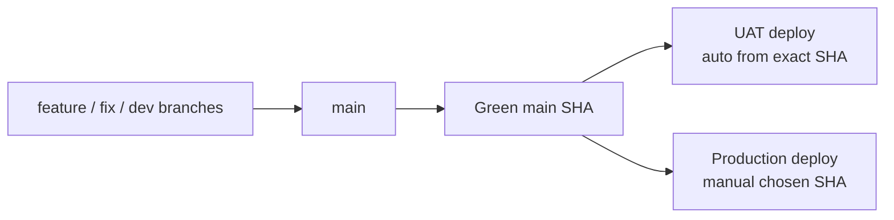

# Branch Governance

## Visual Map

This repo now runs on one integration branch plus SHA-based environment deployment:

| Lane | Purpose | Default policy |
|---|---|---|
| `main` | Team integration branch | Every feature PR targets `main` |
| UAT | Hosted validation environment | Auto-deploys the exact green `main` SHA |
| Production | Live user traffic | Manual deploy of an approved green `main` SHA |

## Working Rules

1. Start all development branches from `main`.
2. Merge all feature/fix/docs work back into `main`.
3. Do not use `deploy_uat` or `deploy` as release branches; they are retired from the deployment path.
4. UAT deploys only from a successful `Main Post-Merge Smoke` run on `main` and uses that exact commit SHA.
5. Production deploys only from a manually chosen SHA that is reachable from `origin/main` and already green in CI.
6. Do not open release PRs into environment branches; the deployment source of truth is `main`.

## Branch Types and Retention

| Branch type | Naming pattern | Retention |
|---|---|---|
| Developer branch | `feature/*`, `feat/*`, `agent_*`, developer-owned names | Keep while active |
| Hotfix branch | `fix/*` | Delete after merge to `main` and successful UAT validation |
| Deployment artifact | exact green `main` SHA | Keep in Git history and deployment logs |
| Local backup branch | `backup/*`, `publishable/*` | Audit unique commits, salvage if needed, then delete |

Before deleting a local backup branch, classify its unique commits as:

1. already represented in `main`
2. obsolete and safe to drop
3. still valuable and worth promoting onto a fresh salvage branch from current `main`

## Deployment Lanes

### UAT

1. Auto-deploys only after a successful `Main Post-Merge Smoke` push run on `main`.
2. The workflow checks out the exact green `main` SHA from that CI run.
3. Manual dispatch is limited to `kushaltrivedi5`, `Akash-292`, and `RGlodAkshat` for redeploying a chosen green `main` SHA.
4. Workflow preflight fails if the requested SHA is not reachable from `origin/main`.
5. Workflow preflight also fails if the SHA does not already have a successful `Main Post-Merge Smoke Gate`.

### Production

1. Production does not auto-deploy from branch pushes.
2. Production deploys only through a manual workflow dispatch with an explicit green `main` SHA.
3. The workflow validates that the SHA is reachable from `origin/main`.
4. The workflow also validates that `Main Post-Merge Smoke Gate` succeeded for that SHA before deployment starts.
5. Only `kushaltrivedi5` may dispatch the production workflow after the SHA preflight passes.

## Hotfix Playbook

1. Create the hotfix branch from the latest `main`.
2. Merge the hotfix into `main`.
3. Let UAT auto-deploy the new green `main` SHA, or manually redeploy that same SHA to UAT if needed.
4. If another blocker appears after that rollout, create a new hotfix branch from the updated `main`.
5. Do not reuse an already-merged hotfix branch for a second fix.

## GitHub Admin Checklist

### `main`

1. Require pull requests before merge.
2. Require the `CI Status Gate` status check.
3. Keep classic branch protection non-strict; freshness is enforced through merge queue, not per-PR rebasing churn.
4. Enable merge queue for `main`.
5. Block force-pushes.
6. Block branch deletion.
7. Use review bypass plus the dedicated `main-bypass-queue` team for the 3 core owners only; do not rely on overlapping push restrictions.
8. Keep ordinary development off `main`; use PRs from developer branches.

Current operating note:

- `enforce_admins` should stay enabled
- verify the live setting with `../../../scripts/ci/verify-main-branch-protection.sh`
- admin ownership does not count as an independent PR approval
- a PR author cannot self-approve through GitHub; review remains a separate state from admin privileges
- the current live `main` branch protection review-bypass allowlist is `kushaltrivedi5`, `Akash-292`, and `RGlodAkshat`
- the current live merge-queue bypass team is `main-bypass-queue`, containing those same 3 users only
- if an admin needs to proceed on a green PR, verify whether the live ruleset allows queue entry; do not assume approval is implicitly satisfied
- bypass actors may waive review through branch protection and bypass queue through the dedicated owner team path
- direct pushes to `main` are not the default bypass model; the preferred path is a green PR plus bypass merge
- CI should still gate the landing decision; bypass is for review policy, not for skipping validation

### Retired release branches

1. `deploy_uat` and `deploy` are no longer part of the deployment control plane.
2. They should not carry required checks or workflow expectations for new rollouts.
3. Leave them inert or archive/remove them only after the team confirms no external automation still points at them.

## Production Deployment Environment

The production workflow uses one active GitHub environment name:

| Environment | Intended use |
|---|---|
| `production-owner-bypass` | Owner-only production deploy lane for `kushaltrivedi5` |

Operational rules:

1. Only `kushaltrivedi5` may dispatch the production workflow.
2. Other developers may still merge to `main` through PR flow, but production dispatch remains owner-only.
3. `production-owner-bypass` should not require reviewers and should not allow admin bypass.
4. Verify the live setup with `../../../scripts/ci/verify-production-environment-governance.sh`.
