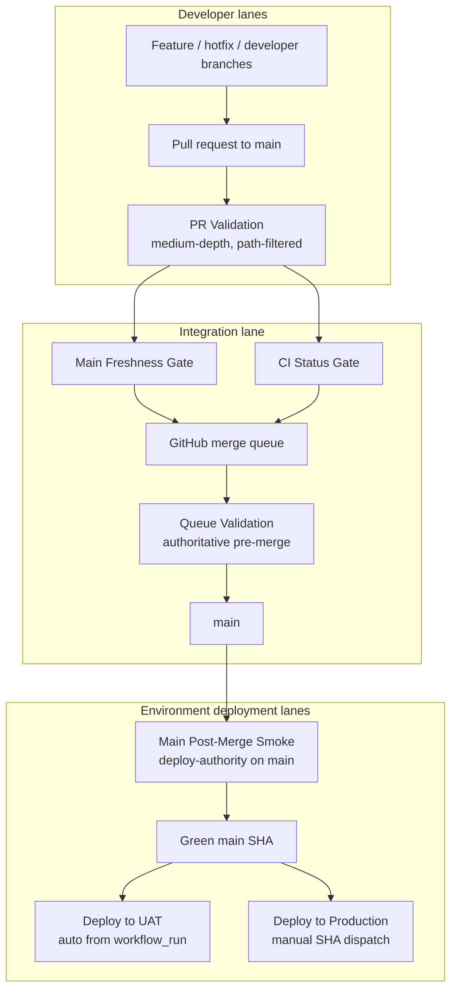

# CI Configuration Reference


## Visual Map



This document describes the queue-first CI model and how to stay aligned with it so code changes do not fail CI or deploy from the wrong authority gate. Run local checks before every commit.

**Workflow files:** [.github/workflows/ci.yml](../../../.github/workflows/ci.yml), [.github/workflows/queue-validation.yml](../../../.github/workflows/queue-validation.yml), [.github/workflows/main-post-merge-smoke.yml](../../../.github/workflows/main-post-merge-smoke.yml)  
**Local mirror:** [`./bin/hushh ci`](./cli.md)  
**Orchestrator:** [scripts/ci/orchestrate.sh](../../../scripts/ci/orchestrate.sh)

## Monitoring Rule

After any merge to `main`, bypass merge, deploy trigger, or manual workflow dispatch, keep monitoring the resulting GitHub workflow chain until it reaches a terminal state.

Minimum expectation:

1. watch the immediate `PR Validation`, `Queue Validation`, or dispatched workflow
2. if `main` goes green, watch `Main Post-Merge Smoke`
3. if post-merge smoke goes green, watch downstream `Deploy to UAT`
4. report the exact failing workflow, job, and step if anything fails
5. do not stop at "triggered" or "queued"
6. if the failure is within the CI/deploy/policy surface, move into fix-and-rerun mode until the change is green or a hard blocker is identified
7. when the run is expected to outlive the current chat turn, start the persistent watcher instead of relying on manual follow-up

Codex-first PR watcher:

```bash
./bin/hushh codex ci-status --watch
```

Use this command first for active pull-request checks because it classifies failing jobs into the right owner skill and points to the next workflow pack before dropping to raw `gh run` inspection.

Codex-first RCA surface:

```bash
./bin/hushh codex rca --surface uat --text
./bin/hushh codex rca --surface runtime --text
./bin/hushh codex rca --surface ci --text
```

Use this command when the failure is already on a core authority surface and the next step is classification, not generic monitoring. It preserves structured artifacts and keeps helper-only drift advisory unless it masks a runtime, deploy, DB, or semantic verification failure.

Canonical watcher:

```bash
scripts/ci/watch-gh-workflow-chain.sh --run-id <ci-run-id> --follow-workflow "Main Post-Merge Smoke" --follow-workflow "Deploy to UAT"
```

Local daemon form:

```bash
scripts/ci/watch-gh-workflow-chain.sh --run-id <ci-run-id> --follow-workflow "Main Post-Merge Smoke" --follow-workflow "Deploy to UAT" --daemonize
```

For deploy-only monitoring:

```bash
scripts/ci/watch-gh-workflow-chain.sh --run-id <deploy-run-id> --daemonize
```

The watcher logs to `tmp/devops-watch/`.

---

## Fundamental Blocking Policy

To prevent CI check-sprawl, only these queue/PR checks are hard-blocking by default:

1. `scripts/ci/secret-scan.sh`
2. `scripts/ci/web-check.sh`
3. `scripts/ci/protocol-check.sh`
4. `scripts/ci/integration-check.sh`

The local parity script mirrors the blocking pre-merge validation stages. On GitHub, `main` should require `CI Status Gate` as the blocking status check on PR and queue commits, keep `Main Freshness Gate` advisory on pull requests, enforce freshness authoritatively through merge queue validation, trust `Main Post-Merge Smoke Gate` for deployment eligibility on the landed `main` SHA, and restrict queue bypass to the dedicated three-person owner team only.

### PKM rollout blocker

Production rollout is blocked unless PKM compatibility stays green for supported stored-version paths. The blocking CI manifests now explicitly include:

1. frontend `__tests__/services/pkm-upgrade-orchestrator.test.ts`
2. backend `tests/test_pkm_upgrade_routes.py`

These are the minimum gates for:

1. missing-manifest compatibility
2. malformed/legacy manifest normalization
3. manifest-authoritative upgrade truth when index summaries lag behind
4. structured PKM failure metadata reaching the task center

Local/UAT release rehearsal should additionally run the Kai no-write PKM drill before production rollout:

1. automatic upgrade start from app entry after unlock
2. no-write dummy save validation for the Kai drill user
3. post-upgrade investor / RIA / consent smoke from [Kai Runtime Smoke Checklist](../kai/kai-runtime-smoke-checklist.md)

The canonical blocker for that broader surface is:

1. [scripts/ci/pkm-upgrade-gate.sh](../../../scripts/ci/pkm-upgrade-gate.sh)
2. `integration-check.sh` now runs this gate on every blocking CI pass
3. when `PKM_UPGRADE_RUNTIME_AUDIT_BASE_URL` is set, the same gate also runs the live Playwright investor / RIA / PKM audits against that runtime

## When CI Runs

| Trigger | Branches | Behavior |
|--------|-----------|----------|
| Pull request | All branches (`**`) | `PR Validation` medium-depth CI (path-filtered) |
| Merge queue | `main` | `Queue Validation` full authoritative pre-merge CI |
| Push | `main` | `Main Post-Merge Smoke` compact deploy-authority smoke |
| Manual | Any | `PR Validation` `workflow_dispatch` with scope: `frontend` \| `backend` \| `all` |

**Path filters:** `PR Validation` runs jobs only when relevant paths change (or when run manually with a scope). `Queue Validation` runs both stacks for deterministic gating, and `Main Post-Merge Smoke` stays compact rather than path-filtered.

- **Frontend job** runs when `hushh-webapp/**` changes.
- **Backend job** runs when `consent-protocol/**` changes.
- **Integration job** runs when either frontend or backend paths change.

### Duplicate-Run Policy

Feature and hotfix branches intentionally rely on `pull_request` CI only. Merge queue absorbs stale-base risk before merge, and `main` then runs a smaller smoke bundle on the real landed SHA.

---

## Global Gates (Always Run)

| Gate | Purpose | Behavior |
|------|---------|----------|
| Secret Scan | Detect leaked credentials/tokens early | `gitleaks` OSS CLI scans the event commit range, blocks on open GitHub secret-scanning alerts, and reports Dependabot backlog through the GitHub API |
| Upstream Sync | Detect monorepo/subtree drift | Advisory only; warnings are non-blocking |
| Main Freshness Gate | Show branch freshness before merge | Advisory on pull requests, blocking on `merge_group` |
| CI Status Gate | Single required check for branch protection | Fails if any required job fails/cancels/times out; allows intentional `skipped` jobs |

## Live GitHub Enforcement

Protected branches are expected to enforce the same CI contract documented here:

- `main`
  - at least `1` approving review
  - required status checks: `CI Status Gate`
  - strict/up-to-date checks enabled
  - conversation resolution required
  - merge queue enabled for `main`
- force-pushes disabled
- branch deletion disabled

The live GitHub setting can drift from the docs, so verify it directly:

```bash
./scripts/ci/verify-main-branch-protection.sh
```

Current live nuance:

- the repo uses branch protection for review, freshness, and conversation-resolution requirements
- bypass actors should be limited to the 3 core owners, without overlapping push-restriction lists

### GitHub Alert Parity

The secret gate is intentionally stricter than raw regex scanning:

- local runs use authenticated `gh` access to compare against open GitHub secret-scanning and Dependabot alerts
- CI uses a dedicated repo secret such as `GH_SECURITY_ALERTS_TOKEN` so GitHub Actions can read the same alert surfaces
- the final blocking mode fails if either:
  - `gitleaks` finds a leak in the scanned commit range, or
  - GitHub still reports any open secret-scanning alerts
- open Dependabot alerts are currently advisory in CI; they are still reported in logs and should be managed as backlog, but they do not block unrelated merges

## Advisory Checks (Non-Blocking By Default)

1. `scripts/ci/docs-parity-check.sh`
2. `scripts/ci/subtree-sync-check.sh`
3. `npm run verify:investor-language`
4. Native build/smoke checks (`./bin/hushh native ios --mode uat`, `./bin/hushh native android --mode uat`) for native release lanes
5. `scripts/ops/verify-env-secrets-parity.py` for release preflight and deployment readiness
6. Broad full-suite pytest runs and Kai accuracy/compliance suites

Do not add new CI/parity scripts without replacing or consolidating an existing check.

## Lean Required Gate Model

The required pre-merge lane stays intentionally small:

1. secret scan
2. DCO signoff
3. governance drift (`docs verify`, Apache/license surface, skill lint)
4. release contract alignment (`./bin/hushh db verify-release-contract`)
5. changed-surface web/backend checks
6. cross-surface integration checks

Post-merge smoke remains the deployment eligibility gate for `main`.

### Script Lifecycle Policy

1. Add a new CI/helper script only when it replaces or consolidates an existing one in the same PR.
2. Every CI/helper script must have a clear owner (`frontend`, `backend`, or `platform`) in PR notes.
3. Any CI scope expansion requires reviewer approval from the owning team.

## Branch Lanes

1. `main` is the only integration branch for day-to-day development.
2. A successful `Main Post-Merge Smoke` run produces the only deployable source of truth: the green `main` SHA.
3. UAT auto-deploys from that green `main` SHA through `.github/workflows/deploy-uat.yml`.
4. Manual UAT dispatch is limited to `kushaltrivedi5`, `Akash-292`, and `RGlodAkshat`.
5. Production deploys only through a manual SHA dispatch in `.github/workflows/deploy-production.yml`, and only `kushaltrivedi5` may trigger it.
6. Manual UAT or production redeploys must use a SHA that is reachable from `origin/main` and already green in post-merge smoke.
7. Feature or hotfix branches never deploy directly; they merge through `main`.

Deploy to UAT is expected to behave as a closed-loop release lane:

1. sync canonical secrets
2. capture last healthy revisions
3. deploy changed surfaces
4. verify runtime mounts and semantic behavior
5. retry once on transient readiness
6. roll back only the failing changed surface
7. publish release artifacts with revisions, reports, and final status

See [Branch Governance](./branch-governance.md).

---

## Required Versions (Must Match CI)

| Tool | CI Version | Local requirement |
|------|------------|-------------------|
| Node.js | 20 | 20+ (run `./bin/hushh ci`) |
| Python | 3.13 | 3.13 (CI asserts exactly 3.13) |
| npm | latest | Use latest (script upgrades before run) |
| uv | pinned by workflow | install `uv` locally and use `uv sync --frozen --group dev` |

Using a different Node or Python locally can cause “pass locally, fail in CI” if behavior or dependencies differ.

---

## Frontend Checks (Web / Next.js)

**Working directory:** `hushh-webapp/`

| Step | Command / behavior | Fails CI? |
|------|--------------------|-----------|
| Validate files | `package-lock.json` exists and valid JSON; `next.config.ts` exists | Yes |
| Install | `npm ci` | Yes |
| Design system | `npm run verify:design-system` | Yes |
| Cache coherence | `npm run verify:cache` | Yes |
| Docs/runtime parity | `npm run verify:docs` | Yes |
| TypeScript | `npm run typecheck` | Yes |
| Lint | `npm run lint -- --max-warnings=${WEB_LINT_WARNING_BUDGET}` | Yes |
| Build (web) | `npm run build` (Next.js) | Yes |
| Security audit budget | `npm audit --json` + budget gate (`moderate/high/critical`) | Yes |
| Tests | `npm run test:ci` (manifest-driven curated suites) | Yes |

**Build env (CI):** `NEXT_PUBLIC_BACKEND_URL` and all six `NEXT_PUBLIC_FIREBASE_*` vars are set to placeholders in the workflow so the build does not depend on real secrets.

**Coding rules that affect CI:**

- Do **not** use `fetch("/api/...")` in components or pages; use the service layer (see [Architecture](../architecture/architecture.md)).
- ESLint must pass with zero warnings (`--max-warnings=0`).
- TypeScript must compile with no errors.

---

## Backend Checks (Python / FastAPI)

**Working directory:** `consent-protocol/`

| Step | Command / behavior | Fails CI? |
|------|--------------------|-----------|
| Validate files | `pyproject.toml`, `uv.lock`, generated `requirements*.txt`, and `tests/` | Yes |
| Install | `uv sync --frozen --group dev` plus `bash scripts/sync_runtime_requirements.sh --check` | Yes |
| Lint | `uv run ruff check .` | Yes |
| Type check | `uv run mypy --config-file pyproject.toml --ignore-missing-imports` | Yes |
| Security | `uv run bandit -r hushh_mcp/ api/ -c pyproject.toml -ll` | Yes |
| Tests | `bash scripts/run-test-ci.sh` (manifest-driven curated suites) | Yes |

Blocking backend manifest:

1. `consent-protocol/scripts/test-ci.manifest.txt`
2. Keep this manifest small and stable.
3. Full local repo checks are available through `./bin/hushh test`.
4. Kai accuracy/compliance remains manual through `./bin/hushh protocol accuracy`.

**Test env (CI):**  
`TESTING=true`, `APP_SIGNING_KEY`, and `VAULT_DATA_KEY` are set in the workflow (see [ci.yml](../../../.github/workflows/ci.yml)).

**Consent-token rule for automated tests:** Use fixture-issued VAULT_OWNER tokens from `consent-protocol/tests/conftest.py`. `consent-protocol/tests/dev_test_token.py` is debug-only and must not be required by CI.

**Config files:**

- **Ruff:** [consent-protocol/pyproject.toml](../../../consent-protocol/pyproject.toml) — `[tool.ruff]` and `[tool.ruff.lint]`. Target Python 3.13, line-length 100, selected rules (E, F, B, I, S), per-file ignores for tests and routes.
- **Mypy:** Same `pyproject.toml` — `[tool.mypy]`. Python 3.13, `warn_return_any`, `ignore_missing_imports`, overrides for `hushh_mcp.*` and consent/vault.

**Coding rules that affect CI:**

- Use **Python 3.13**-compatible syntax and types.
- Avoid ambiguous names (e.g. single-letter `l`) so Ruff doesn’t flag them.
- Optional args: use `Optional[T] = None`, not `T = None`, to satisfy mypy.
- Return types: avoid returning untyped `Any` from functions that declare a concrete return type; use `cast()` or correct types so mypy passes.
- New backend code under `consent-protocol/` is type-checked and linted; keep `api/` and `db/` aligned with mypy and Ruff.

---

## Integration Check (Route and Docs Contract)

**Runs when:** Frontend or backend paths change (or manual run with scope that includes either).

| Step | Command / behavior | Fails CI? |
|------|--------------------|-----------|
| Verify | `bash scripts/ci/docs-parity-check.sh` | Yes |

Route contracts must stay in sync between frontend expectations, backend (or proxy) routes, and the route/mobile docs. See [API Contracts](../architecture/api-contracts.md). If you add or change routes, update the contract and run the docs parity lane (or full local CI).

---

## Streaming Contract Gates

Canonical streaming is a production contract, not an implementation detail.

- Contract source: [Streaming Contract](../streaming/streaming-contract.md)
- Runtime pattern: [Streaming Implementation Guide](../streaming/streaming-implementation-guide.md)
- Vertex constraints: [Vertex AI Streaming Notes](../streaming/vertex-ai-streaming-notes.md)

Minimum checks for streaming changes:

- Frontend stream checks: `cd hushh-webapp && npm run test:ci` (includes streaming/parser suites)
- Backend stream/auth tests: `cd consent-protocol && pytest tests/test_kai_auth_matrix.py`

---

## Running CI Locally (Before Every Commit)

**Recommended:** Run the script that mirrors CI. It uses the same versions and steps as GitHub Actions.

```bash
./bin/hushh ci
```

This script:

1. Validates required files (e.g. `package-lock.json`, `next.config.ts`, `pyproject.toml`, `uv.lock`, generated runtime artifacts, test files).
2. Checks Node (20+) and Python (3.13) and uses `uv` as the canonical backend toolchain.
3. Runs **frontend** checks: install, `tsc`, lint, Next build, audit-budget gate, curated test suite.
4. Runs **backend** checks: shared parity verification, install, Ruff, mypy, Bandit, curated test suite.
5. Runs **integration**: route/runtime contract verification.

To include advisory checks locally:

```bash
./bin/hushh ci --include-advisory
```

This advisory lane now includes the Codex operating-system audit:

```bash
./bin/hushh codex audit
```

To verify the live GitHub branch gate matches the documented minimum contract:

```bash
./scripts/ci/verify-main-branch-protection.sh
```

If it exits 0, CI should pass. If it fails, fix the reported step before committing.

Secret-scan note:

- local and remote CI now both scan the relevant commit range by default
- use `GITLEAKS_LOG_OPTS=--all` only when you intentionally want a full-history audit

---

## Quick Reference: Commands That Must Succeed

| Area | Commands (from repo root) |
|------|----------------------------|
| Frontend | `cd hushh-webapp && npm ci && npm run typecheck && npm run lint -- --max-warnings=0 && npm run build && npm run test:ci` |
| Backend | `cd consent-protocol && uv sync --frozen --group dev && bash scripts/sync_runtime_requirements.sh --check && uv run ruff check . && uv run mypy --config-file pyproject.toml --ignore-missing-imports && uv run bandit -r hushh_mcp/ api/ -c pyproject.toml -ll && bash scripts/run-test-ci.sh` |
| Integration | `bash scripts/ci/docs-parity-check.sh` |
| All | `./bin/hushh ci` |

---

## Strict Launch Gate (Release Cut)

Before creating a release tag/public rollout, run strict gate commands from repo root:

```bash
bash scripts/ci/docs-parity-check.sh
cd hushh-webapp && npm run typecheck
./bin/hushh native ios --mode uat
./bin/hushh native android --mode uat
cd hushh-webapp && npm run verify:cache
cd hushh-webapp && npm run verify:docs
python scripts/ops/verify-env-secrets-parity.py --project hushh-pda --region us-central1 --backend-service consent-protocol --frontend-service hushh-webapp
bash scripts/verify-pre-launch.sh
```

Blocking rule:
- Launch gate is strict-blocking. Any failing check or non-clean git tree is a release blocker.

## Production Deploy DB Governance Gates

The production deploy workflow (`.github/workflows/deploy-production.yml`) enforces additional DB governance before backend deploy:

1. Supabase backup posture gate:
- validates logical backup freshness from GCS manifests via `scripts/ops/logical_backup_freshness_check.py`
- requires latest successful backup age within configured threshold (`BACKUP_MAX_AGE_HOURS`, default `30`)
- optional manual predeploy backup execution via workflow input `run_predeploy_backup_job=true`

2. Migration governance + drift gate:
- checks migration filename monotonicity (`consent-protocol/db/migrations`)
- checks the production-pinned schema contract (`consent-protocol/db/contracts/prod_core_schema.json`)
- allows the repo to be ahead of production while production stays pinned to its approved migration floor
- checks live DB schema contract in read-only mode

3. Manifest artifact:
- emits a production migration release manifest with logical backup evidence (`backup_object_uri`, checksum, completion timestamp)

UAT deploys use a separate latest-integrated contract:

- `consent-protocol/db/contracts/uat_integrated_schema.json`

The daily scheduled workflow `.github/workflows/prod-supabase-backup-posture.yml` runs the same backup posture policy and uploads a report artifact.

---

## Related Docs

- [Getting Started](../../guides/getting-started.md) -- Setup and local CI instructions.
- [API Contracts](../architecture/api-contracts.md) -- API contract verification.
- [Architecture](../architecture/architecture.md) -- Tri-Flow and service-layer rules.
- [Streaming Contract](../streaming/streaming-contract.md) -- Canonical SSE contract.

---

## Upstream CI (consent-protocol standalone)

The consent-protocol has its own full CI pipeline at [hushh-labs/consent-protocol](https://github.com/hushh-labs/consent-protocol/actions). It now runs on all branches plus merge queue and includes: secret scan, lint, typecheck, test, security scan, Docker build verification, and a final status gate.

The monorepo `protocol-check` job is a lightweight mirror. For full coverage, PRs to the upstream repo are the authoritative gate.
