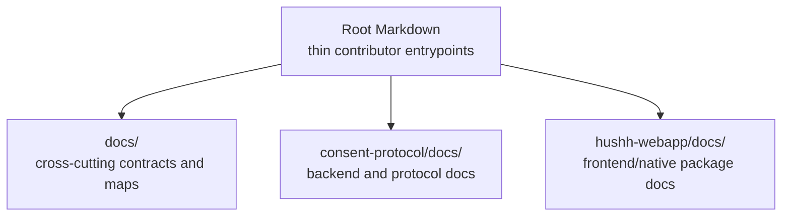

# Documentation Architecture Map

## Visual Map

Use this as the canonical map for documentation placement and consolidation.

## Final Homes

### 1. Root markdowns

Keep these thin:

- `README.md`
- `getting_started.md`
- `contributing.md`
- `TESTING.md`
- policy docs such as `SECURITY.md` and `code_of_conduct.md`

They orient contributors. They do not own the full operational or architectural source of truth.

### 2. `docs/`

This is the canonical home for:

- guides
- architecture
- operations
- quality
- vision

Anything cross-cutting belongs here.

### 3. `consent-protocol/docs/`

This is the canonical home for:

- backend implementation references
- protocol concepts
- MCP/developer API/backend contributor docs

It must remain understandable as a standalone protocol/backend surface.

### 4. `hushh-webapp/docs/`

This is the canonical home for:

- frontend/native package-local references
- plugin contracts
- implementation notes that do not belong in root `docs/`

## Consolidation Rules

Classify every maintained doc as one of:

- `canonical`
- `pointer/index`
- `merge into canonical doc`
- `delete`

Use these rules:

1. Delete stale or redundant docs once the canonical replacement exists.
2. Merge duplicated setup/testing/reference material into one canonical location.
3. Keep root docs thin and link downward.
4. Keep package-specific docs package-local.
5. Update all inbound links in the same change.

## Tier A Diagram Rule

These docs must expose `## Visual Map` or `## Visual Context`:

- canonical indexes
- architecture/map owner docs
- package docs entrypoints
- root docs indexes where they define contributor navigation

One-off maintenance notes do not need diagrams.
