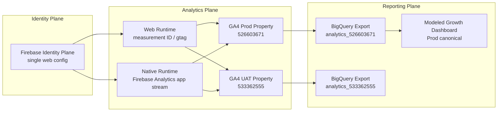
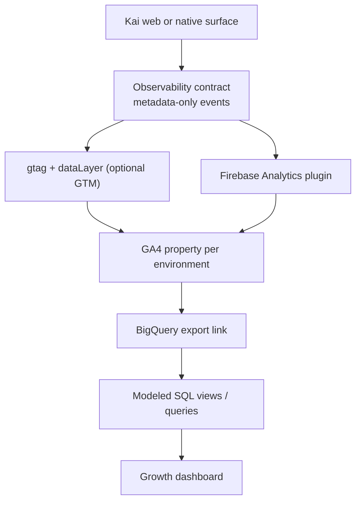
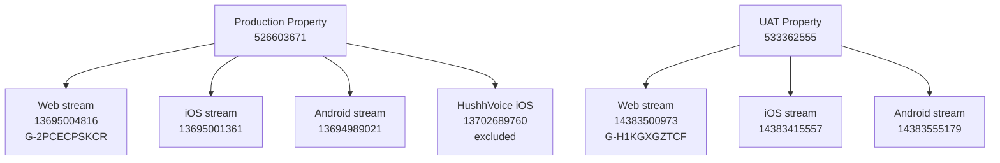
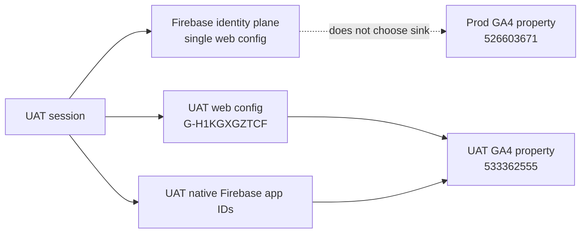

# Observability Architecture Map

## Visual Map

Use this as the canonical map for Kai observability decisions. The system is split into three planes:

1. identity plane
2. analytics collection plane
3. reporting plane

Shared auth is allowed. Shared analytics is not.

## Collection Flow

Rules:

1. Web tagging must not depend on GTM presence.
2. Native tagging must use the Firebase-linked app stream.
3. Dashboards must use modeled queries, not inferred GA cards.

## Environment Split

Environment policy:

1. Production is the only canonical business-reporting surface.
2. UAT is a validation-only analytics lane.
3. `HushhVoice` remains on the production property for now, but Kai reporting excludes it.

## Identity vs Sink

The Firebase identity plane is not the analytics sink.

Sink selection happens here:

1. web: measurement ID chosen at runtime/build time
2. native: Firebase app configuration compiled into the app

Required verification:

1. UAT HTML resolves the UAT measurement ID.
2. UAT native builds map to UAT app streams.
3. UAT DebugView sees UAT validation traffic.
4. Production DebugView does not receive the same UAT validation session.
5. Production dashboard SQL reads only from the production export dataset.

## Canonical Event Hierarchy

The dashboard contract is built around:

1. `growth_funnel_step_completed`
2. `investor_activation_completed`
3. `ria_activation_completed`

Supporting observability events exist for:

1. page views and navigation
2. auth lifecycle
3. onboarding and import lifecycle
4. API request health
5. consent/account/Gmail operations
6. RIA status and workspace lifecycle

See:

- [observability-event-matrix.md](./observability-event-matrix.md)
- [analytics-verification-contract.md](../quality/analytics-verification-contract.md)

## Reporting and Verification Rules

1. Production dashboards read only from `analytics_526603671`.
2. UAT queries read only from `analytics_533362555`, and only for validation.
3. BigQuery export presence is not enough; dataset and event-table materialization must be verified.
4. GA DebugView and Firebase DebugView are validation tools, not the canonical reporting surface.
5. If a KPI can only be explained from raw GA cards and not from modeled SQL, the KPI is not governed well enough yet.
