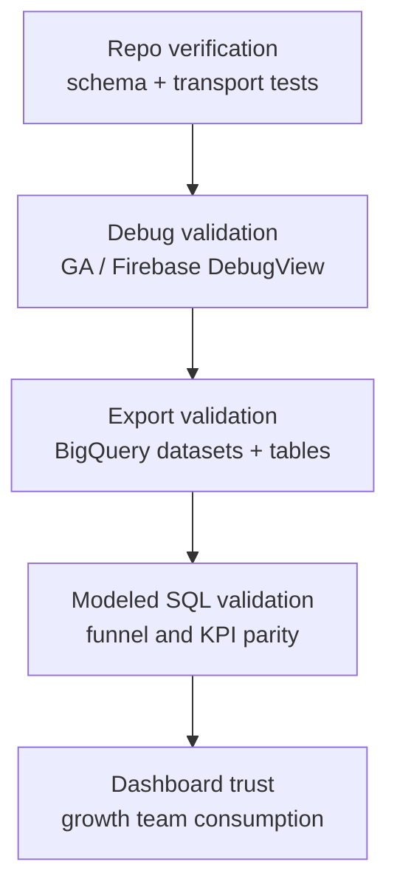

# Analytics Verification Contract

## Visual Context

Canonical visual owner: [Observability Architecture Map](../operations/observability-architecture-map.md). Use that map for topology and plane boundaries; this page is the proof contract that decides whether Kai analytics is trustworthy.

## Purpose

Kai analytics is considered working only when the repo, runtime, GA4, and BigQuery all agree.

This document defines the proof ladder and the failure conditions.

## Proof Ladder



No downstream surface is trusted if the previous rung fails.

## 1. Repo Verification

Required commands:

```bash
cd hushh-webapp
npm run verify:analytics
./bin/hushh docs verify
```

What this proves:

1. the allowed event schema and privacy guardrails still hold
2. the growth helper emits the expected contract
3. native Firebase adapter still exists and is wired
4. web transport still supports direct GA delivery without GTM being mandatory
5. docs and the implementation references remain aligned

Repo verification fails if:

1. `verify:analytics` fails
2. docs verification fails
3. the event schema drifts from the declared contract

## 2. Web Validation

Use GA DebugView plus browser inspection.

Required checks:

1. page HTML resolves the expected measurement ID for the environment:
   - prod: `G-2PCECPSKCR`
   - uat: `G-H1KGXGZTCF`
2. browser network shows GA traffic for real app actions
3. DebugView shows:
   - `growth_funnel_step_completed`
   - `investor_activation_completed`
   - `ria_activation_completed`
4. event params are present and bounded:
   - `journey`
   - `step`
   - `entry_surface`
   - `auth_method`
   - `portfolio_source`
   - `workspace_source`
   - `env`
   - `platform`
   - `app_version`

Identity separation checks:

1. the same UAT session must land in UAT DebugView, not prod DebugView
2. if UAT traffic appears in production DebugView, sink selection is wrong

## 3. Native Validation

Use Firebase / GA DebugView on real or dev devices.

Required checks:

1. iOS and Android both emit growth events into the expected environment property
2. UAT native app IDs map to UAT property `533362555`
3. prod native app IDs map to prod property `526603671`
4. the same canonical growth events appear as on web

Device-debug reminder from Google:

- debug-mode events are excluded from overall Analytics data and from the daily BigQuery export
- use them for validation, not for KPI counting

Reference:

- https://firebase.google.com/docs/analytics/debugview

## 4. Export Validation

GA Admin API proof:

1. production property `526603671` has a BigQuery link
2. UAT property `533362555` has a BigQuery link
3. production export streams include only the three Kai prod streams and exclude `HushhVoice`
4. UAT export streams include the three UAT streams

Project-side proof:

1. production must materialize `analytics_526603671`
2. UAT must materialize `analytics_533362555`
3. event tables must appear:
   - `events_intraday_YYYYMMDD`
   - `events_YYYYMMDD`

Verification commands:

```bash
bq ls -a --project_id hushh-pda
bq ls -a --project_id hushh-pda-uat
bq query --use_legacy_sql=false "SELECT table_name FROM \`hushh-pda.analytics_526603671.INFORMATION_SCHEMA.TABLES\` ORDER BY table_name DESC LIMIT 20"
bq query --use_legacy_sql=false "SELECT table_name FROM \`hushh-pda-uat.analytics_533362555.INFORMATION_SCHEMA.TABLES\` ORDER BY table_name DESC LIMIT 20"
```

Export validation fails if:

1. the GA link exists but the dataset does not materialize
2. the dataset exists but event tables do not
3. the production export includes stream `13702689760`

## 5. Reporting Validation

The dashboard is only valid when modeled SQL agrees with the event contract.

Canonical query surface:

- [ga4_growth_dashboard_queries.sql](/Users/kushaltrivedi/Documents/GitHub/hushh-research/consent-protocol/scripts/observability/ga4_growth_dashboard_queries.sql)

Required modeled surfaces:

1. investor funnel
2. RIA funnel
3. attribution quality
4. platform mix
5. missing-step drift
6. instrumentation health rollup

Reporting rules:

1. production dashboards read only from `analytics_526603671`
2. UAT queries read only from `analytics_533362555`
3. UAT is validation-only and must not back business KPIs
4. `HushhVoice` stream `13702689760` must be excluded from Kai growth models

## 6. Anomaly Checks

| Check | Expected outcome | Failure meaning |
| --- | --- | --- |
| key events non-zero in prod | `investor_activation_completed` and `ria_activation_completed` appear for real usage | conversion setup or live instrumentation is broken |
| funnel monotonicity | entered >= auth >= downstream steps | step loss, route drift, or event-order drift |
| `(direct)/(not set)` share | not dominant for tagged campaigns | attribution capture is incomplete |
| platform mix | reflects real web / iOS / Android traffic | stream mapping or one platform transport is broken |
| missing-step drift | low or explainable | emitter coverage regressed |
| missing `env` / `app_version` | zero or explainable | payload contract drift |
| UAT leakage into prod | absent | measurement ID or app stream configuration is wrong |

## 7. Done Criteria

Kai growth analytics is only considered production-grade when all of these are true:

1. repo verification passes
2. DebugView confirms the canonical events and params
3. production and UAT land in separate properties
4. BigQuery export datasets and tables materialize
5. production modeled queries run against production export only
6. the growth dashboard is fed from modeled BigQuery results rather than raw GA cards
