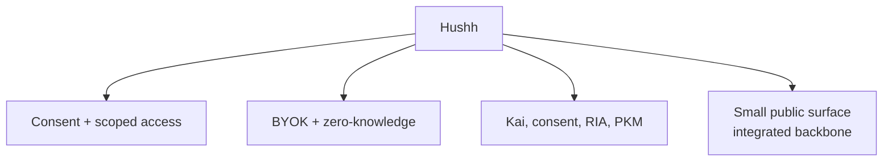

# Hushh Vision

> Build personal AI on consent, scoped access, BYOK, and zero-knowledge boundaries.

## Visual Map

## The Core Idea

Hushh is not trying to make privacy feel cute. It is trying to make trust explicit.

The product thesis is:

- the user owns the key boundary
- the server stores ciphertext
- access is granted through scoped consent
- agents work for the person whose data they touch

Where the shorthand helps, the trust model can be read as:

- **Secure**
- **Scoped**
- **Handled by the user**

## What Hushh Is

Hushh is a platform for personal agents and agent-assisted workflows where:

- identity says who is acting
- the vault defines the encrypted data boundary
- consent tokens define the allowed scope
- apps and agents execute only within that scope

## Why This Matters

| Old model | Hushh model |
| --- | --- |
| implied platform access | explicit scoped access |
| server-readable user state | ciphertext-only storage |
| privacy policy as contract | consent token as contract |
| convenience over auditability | auditability built into the access path |

## Product Direction

Near-term product direction stays the same:

- Kai for investor workflows
- consent center and scoped sharing
- RIA and collaboration surfaces
- multi-domain PKM growth on top of the same trust boundary

What changes is the clarity of the story:

- **consent first**
- **scope first**
- **BYOK**
- **zero-knowledge**

## Planning Boundary

`docs/vision/` is for durable north stars only:

- product thesis
- trust invariants
- enduring assistant philosophy

Speculative workflow architecture, R&D options, and future-roadmap concepts belong in [../future/README.md](../future/README.md), not in `docs/vision/`.

## Monorepo Philosophy

The platform may need a large integrated backbone, but the contributor experience should feel smaller:

- public commands should be minimal
- docs should be modular
- scripts should be self-contained
- the happy path should not require knowing the whole repo

This is the “eukaryotic backbone, bacterial modules” rule for the repo:

- integrated where the platform needs deep coordination
- small, reusable, copy-pasteable pieces everywhere else

## Public Naming Rule

Use **Hushh** in public docs and product copy.

Legacy `Hushh` identifiers that remain in code, env keys, bundle IDs, or service names are compatibility details, not the public brand.
