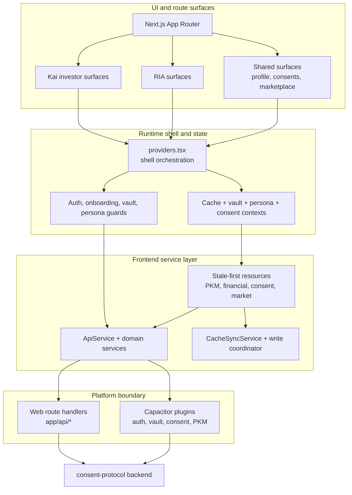

# Hushh WebApp


## Visual Map



Next.js + React + Capacitor client for Kai and consent-first personal data flows.

## Scope

`hushh-webapp` is the frontend subtree in the monorepo. It serves:
- Web (`next dev` / production Next.js runtime)
- iOS and Android shells via Capacitor plugins

Core invariants:
- No direct `fetch()` in feature components (service layer only).
- Vault/PKM operations require consent token + vault context.
- Encrypted-at-rest only (no plaintext fallback mode).

## Current Route Architecture

- `/` -> public marketing onboarding (intro + preview)
- `/login` -> auth-only surface (Google/Apple + disabled phone)
- `/kai/onboarding` -> onboarding questionnaire + persona
- `/kai/import` -> import/connect flow + vault introduction
- `/kai` -> signed-in info home + first-time bottom-nav tour
- `/kai/portfolio` -> portfolio analytics/dashboard

Guard flow:
- `KaiOnboardingGuard` blocks non-onboarding `/kai/*` when onboarding is incomplete.
- `VaultLockGuard` enforces unlock only when vault exists and protected access is needed.

## Vault Security Model

Supported active methods:
- `passphrase`
- `generated_default_native_biometric`
- `generated_default_web_prf`

Rules:
- Single active KEK model.
- Switching method re-wraps the same vault key.
- Recovery key fallback stays mandatory.
- If custom passphrase is skipped, generated secure default path is used (still encrypted).

## Dashboard and Onboarding Composition

- Dashboard v2 composition:
  - `components/kai/views/dashboard-master-view.tsx`
  - `components/kai/cards/*`
- First-time nav tour on `/kai`:
  - `components/kai/onboarding/kai-nav-tour.tsx`
  - `lib/services/kai-nav-tour-local-service.ts`
  - `lib/services/kai-nav-tour-sync-service.ts`
- Canonical cross-device onboarding/tour state:
  - encrypted `kai_profile` domain

## Design System

Use fused stack:
- Morphy UX for brand surfaces/CTA physics
- shadcn/ui as stock primitives (`components/ui/*`)
- Lucide through `Icon` wrapper (`lib/morphy-ux/ui/icon.tsx`)
- `components/app-ui/*` for Hushh semantic shell/page surfaces
- `app/labs`, `components/labs`, and `lib/labs` for experimental work only

References:
- `docs/reference/quality/design-system.md`
- `docs/reference/quality/frontend-ui-architecture-map.md`
- `docs/reference/quality/frontend-pattern-catalog.md`
- `hushh-webapp/components/README.md`

## Local Development

```bash
cd ..
./bin/hushh bootstrap
./bin/hushh web --mode uat
```

Package-local commands still exist when you are already inside `hushh-webapp/` and intentionally working at the package layer:

```bash
cd hushh-webapp
npm install
npm run dev
```

## Verification Commands

```bash
cd hushh-webapp
npm run typecheck
npm test
npm run build
npm run ios:test
```

Backend tests (monorepo sibling):

```bash
cd consent-protocol
.venv/bin/python -m pytest -q
```
