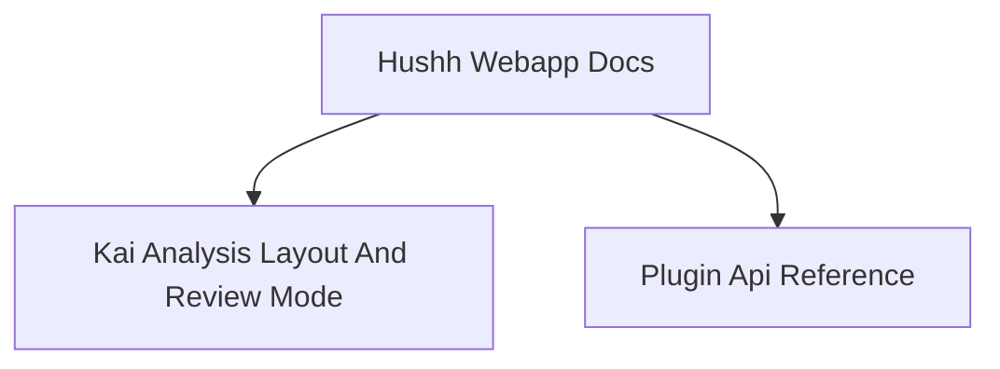

# Hushh Webapp Docs

## Visual Map

Frontend and native-client implementation references for the webapp package.

This docs home is package-local. It should stay focused on frontend/native implementation material that does not belong in cross-cutting root `docs/`.

## Documents

| Document | Scope |
| -------- | ----- |
| [plugin-api-reference.md](./plugin-api-reference.md) | Capacitor plugin contracts and parameter parity |
| [kai-analysis-layout-and-review-mode.md](./kai-analysis-layout-and-review-mode.md) | Kai analysis UI layout and app-review runtime behavior |

## Source Tree Indexes

- [../components/app-ui/README.md](../components/app-ui/README.md)
- [../components/consent/README.md](../components/consent/README.md)
- [../components/kai/README.md](../components/kai/README.md)
- [../components/ria/README.md](../components/ria/README.md)
- [../lib/services/README.md](../lib/services/README.md)

## Related References

- Cross-cutting docs entry: [`docs/README.md`](../../docs/README.md)
- Documentation homes map: [`docs/reference/operations/documentation-architecture-map.md`](../../docs/reference/operations/documentation-architecture-map.md)
- Backend docs entry: [`consent-protocol/docs/README.md`](../../consent-protocol/docs/README.md)
